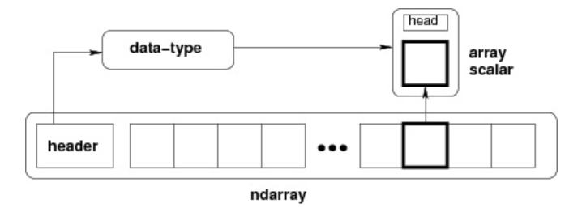

# NumPy Ndarray 对象
ndarray 对象是用于存放同类型元素的多维数组。

ndarray 中的每个元素在内存中都有相同存储大小的区域。

ndarray 内部由以下内容组成：

- 一个指向数据（内存或内存映射文件中的一块数据）的指针。

- 数据类型或 dtype，描述在数组中的固定大小值的格子。

- 一个表示数组形状（shape）的元组，表示各维度大小的元组。

- 一个跨度元组（stride），其中的整数指的是为了前进到当前维度下一个元素需要"跨过"的字节数。

ndarray 的内部结构:

跨度可以是负数，这样会使数组在内存中后向移动，切片中 obj[::-1] 或 obj[:,::-1] 就是如此。

创建一个 ndarray 只需调用 NumPy 的 array 函数即可：

`
numpy.array(object, dtype = None, copy = True, order = None, subok = False, ndmin = 0)
`

```
参数说明：

名称	描述
object	数组或嵌套的数列
dtype	数组元素的数据类型，可选
copy	对象是否需要复制，可选
order	创建数组的样式，C为行方向，F为列方向，A为任意方向（默认）
subok	默认返回一个与基类类型一致的数组
ndmin	指定生成数组的最小维度
```
```python
import numpy as np 
a = np.array([1,2,3])  
print (a)

# 多于一个维度  
import numpy as np 
a = np.array([[1,  2],  [3,  4]])  
print (a)

# 最小维度  
import numpy as np 
a = np.array([1, 2, 3, 4, 5], ndmin =  2)  
print (a)

# dtype 参数  
import numpy as np 
a = np.array([1,  2,  3], dtype = complex)  
print (a)
```

# 数据类型
## 数据类型对象 (dtype)
数据类型对象（numpy.dtype 类的实例）用来描述与数组对应的内存区域是如何使用，它描述了数据的以下几个方面：：

* 数据的类型（整数，浮点数或者 Python 对象）
* 数据的大小（例如， 整数使用多少个字节存储）
* 数据的字节顺序（小端法或大端法）
* 在结构化类型的情况下，字段的名称、每个字段的数据类型和每个字段所取的内存块的部分
* 如果数据类型是子数组，那么它的形状和数据类型是什么。

dtype 对象是使用以下语法构造的：
`
numpy.dtype(object, align, copy)`
* object - 要转换为的数据类型对象
* align - 如果为 true，填充字段使其类似 C 的结构体。
* copy - 复制 dtype 对象 ，如果为 false，则是对内置数据类型对象的引用

```python
import numpy as np
# 使用标量类型
dt = np.dtype(np.int32)
print(dt)

import numpy as np
# int8, int16, int32, int64 四种数据类型可以使用字符串 'i1', 'i2','i4','i8' 代替
dt = np.dtype('i4')
print(dt)

import numpy as np
# 字节顺序标注
dt = np.dtype('<i4')
print(dt)

# 首先创建结构化数据类型
import numpy as np
dt = np.dtype([('age',np.int8)]) 
print(dt)

# 将数据类型应用于 ndarray 对象
import numpy as np
dt = np.dtype([('age',np.int8)]) 
a = np.array([(10,),(20,),(30,)], dtype = dt) 
print(a)

# 类型字段名可以用于存取实际的 age 列
import numpy as np
dt = np.dtype([('age',np.int8)]) 
a = np.array([(10,),(20,),(30,)], dtype = dt) 
print(a['age'])

import numpy as np
student = np.dtype([('name','S20'), ('age', 'i1'), ('marks', 'f4')]) 
print(student)

import numpy as np
student = np.dtype([('name','S20'), ('age', 'i1'), ('marks', 'f4')]) 
a = np.array([('abc', 21, 50),('xyz', 18, 75)], dtype = student) 
print(a)
```


```python
#结构化数据类型是通过一个描述字段名称、字段数据类型以及（可选的）字段大小的列表来定义的。例如：
import numpy as np
dt = np.dtype([
    ('name', 'U10'),  # Unicode 字符串，最大长度为 10
    ('age', 'i4'),    # 32 位整数
    ('height', 'f4')  # 32 位浮点数
])
# 在这个例子中，我们定义了一个结构化数据类型 dt，它包含三个字段：'name'、'age' 和 'height'，分别对应于字符串、整数和浮点数类型。
# 
# 创建结构化数组
# 使用定义好的结构化数据类型，您可以创建结构化数组：


data = np.array([
    ('Alice', 25, 1.65),
    ('Bob', 30, 1.75),
    ('Charlie', 35, 1.80)
], dtype=dt)
# 在这个例子中，我们创建了一个结构化数组 data，其中每个元素都是一个具有三个字段的记录。
# 
# 访问结构化数组的字段
# 您可以使用字段名称来访问结构化数组中的数据：


print(data['name'])   # 访问 'name' 字段
print(data['age'])    # 访问 'age' 字段
print(data['height']) # 访问 'height' 字段
# 这将分别输出 data 数组中所有记录的 'name'、'age' 和 'height' 字段的值。
# 
# 修改结构化数组的字段
# 您还可以修改结构化数组中的字段值：


data['age'] += 1  # 为所有记录的 'age' 字段加 1
# 这将把 data 数组中每个记录的 'age' 字段的值增加 1。
# 
# 使用结构化数组
# 结构化数组非常适合处理具有固定模式的复杂数据，如 CSV 文件、数据库查询结果或其他表格数据。您可以使用 NumPy 的强大功能来对这些数据进行高效的计算和分析。

```


```txt
字符	对应类型
b	布尔型
i	(有符号) 整型
u	无符号整型 integer
f	浮点型
c	复数浮点型
m	timedelta（时间间隔）
M	datetime（日期时间）
O	(Python) 对象
S, a	(byte-)字符串
U	Unicode
V	原始数据 (void)
```

# NumPy 数组属性
NumPy 数组的维数称为秩（rank），秩就是轴的数量，即数组的维度，一维数组的秩为 1，二维数组的秩为 2，以此类推。

在 NumPy中，每一个线性的数组称为是一个轴（axis），也就是维度（dimensions）。比如说，二维数组相当于是两个一维数组，其中第一个一维数组中每个元素又是一个一维数组。所以一维数组就是 NumPy 中的轴（axis），第一个轴相当于是底层数组，第二个轴是底层数组里的数组。而轴的数量——秩，就是数组的维数。

很多时候可以声明 axis。axis=0，表示沿着第 0 轴进行操作，即对每一列进行操作；axis=1，表示沿着第1轴进行操作，即对每一行进行操作。

NumPy 的数组中比较重要 ndarray 对象属性有：
```txt
属性	说明
ndarray.ndim	秩，即轴的数量或维度的数量
ndarray.shape	数组的维度，对于矩阵，n 行 m 列
ndarray.size	数组元素的总个数，相当于 .shape 中 n*m 的值
ndarray.dtype	ndarray 对象的元素类型
ndarray.itemsize	ndarray 对象中每个元素的大小，以字节为单位
ndarray.flags	ndarray 对象的内存信息
ndarray.real	ndarray元素的实部
ndarray.imag	ndarray 元素的虚部
ndarray.data	包含实际数组元素的缓冲区，由于一般通过数组的索引获取元素，所以通常不需要使用这个属性。
```
```python
import numpy as np 
 
a = np.arange(24)  
print (a.ndim)             # a 现只有一个维度
# 现在调整其大小
b = a.reshape(2,4,3)  # b 现在拥有三个维度
print (b.ndim)

import numpy as np  
 
a = np.array([[1,2,3],[4,5,6]])  
print (a.shape)

import numpy as np 
 
a = np.array([[1,2,3],[4,5,6]]) 
a.shape =  (3,2)  
print (a)

import numpy as np 
 
a = np.array([[1,2,3],[4,5,6]]) 
b = a.reshape(3,2)  
print (b)

import numpy as np 
#  
# ndarray.itemsize 以字节的形式返回数组中每一个元素的大小。
# 
# 例如，一个元素类型为 float64 的数组 itemsize 属性值为 8(float64 占用 64 个 bits，每个字节长度为 8，所以 64/8，占用 8 个字节），又如，一个元素类型为 complex32 的数组 item 属性为 4（32/8）。


# 数组的 dtype 为 int8（一个字节）  
x = np.array([1,2,3,4,5], dtype = np.int8)  
print (x.itemsize)
 
# 数组的 dtype 现在为 float64（八个字节） 
y = np.array([1,2,3,4,5], dtype = np.float64)  
print (y.itemsize)


```

```txt
ndarray.flags
ndarray.flags 返回 ndarray 对象的内存信息，包含以下属性：

属性	描述
C_CONTIGUOUS (C)	数据是在一个单一的C风格的连续段中
F_CONTIGUOUS (F)	数据是在一个单一的Fortran风格的连续段中
OWNDATA (O)	数组拥有它所使用的内存或从另一个对象中借用它
WRITEABLE (W)	数据区域可以被写入，将该值设置为 False，则数据为只读
ALIGNED (A)	数据和所有元素都适当地对齐到硬件上
UPDATEIFCOPY (U)	这个数组是其它数组的一个副本，当这个数组被释放时，原数组的内容将被更新
```

```python
import numpy as np 
 
x = np.array([1,2,3,4,5])  
print (x.flags)
```
```
  C_CONTIGUOUS : True
  F_CONTIGUOUS : True
  OWNDATA : True
  WRITEABLE : True
  ALIGNED : True
  WRITEBACKIFCOPY : False
  UPDATEIFCOPY : False
  ```

# 创建数组
## numpy.empty
numpy.empty 方法用来创建一个指定形状（shape）、数据类型（dtype）且未初始化的数组：
`numpy.empty(shape, dtype = float, order = 'C')`
```text
参数说明：

参数	描述
shape	数组形状
dtype	数据类型，可选
order	有"C"和"F"两个选项,分别代表，行优先和列优先，在计算机内存中的存储元素的顺序。
```
```python
import numpy as np 
x = np.empty([3,2], dtype = int) 
print (x)
```
注意 − 数组元素为随机值，因为它们未初始化。

## numpy.zeros
创建指定大小的数组，数组元素以 0 来填充：
`numpy.zeros(shape, dtype = float, order = 'C')`
```text
参数说明：

参数	描述
shape	数组形状
dtype	数据类型，可选
order	'C' 用于 C 的行数组，或者 'F' 用于 FORTRAN 的列数组
```
```python
import numpy as np
 
# 默认为浮点数
x = np.zeros(5) 
print(x)
 
# 设置类型为整数
y = np.zeros((5,), dtype = int) 
print(y)
 
# 自定义类型
z = np.zeros((2,2), dtype = [('x', 'i4'), ('y', 'i4')])  
print(z)
```
## numpy.ones
创建指定形状的数组，数组元素以 1 来填充：

`numpy.ones(shape, dtype = None, order = 'C')`
```python
import numpy as np
 
# 默认为浮点数
x = np.ones(5) 
print(x)
 
# 自定义类型
x = np.ones([2,2], dtype = int)
print(x)
```
## numpy.zeros_like
numpy.zeros_like 用于创建一个与给定数组具有相同形状的数组，数组元素以 0 来填充。

numpy.zeros 和 numpy.zeros_like 都是用于创建一个指定形状的数组，其中所有元素都是 0。

它们之间的区别在于：numpy.zeros 可以直接指定要创建的数组的形状，而 numpy.zeros_like 则是创建一个与给定数组具有相同形状的数组。

`numpy.zeros_like(a, dtype=None, order='K', subok=True, shape=None)`
```text

参数	描述
a	给定要创建相同形状的数组
dtype	创建的数组的数据类型
order	数组在内存中的存储顺序，可选值为 'C'（按行优先）或 'F'（按列优先），默认为 'K'（保留输入数组的存储顺序）
subok	是否允许返回子类，如果为 True，则返回一个子类对象，否则返回一个与 a 数组具有相同数据类型和存储顺序的数组
shape	创建的数组的形状，如果不指定，则默认为 a 数组的形状。
```
```python
import numpy as np
 
# 创建一个 3x3 的二维数组
arr = np.array([[1, 2, 3], [4, 5, 6], [7, 8, 9]])
 
# 创建一个与 arr 形状相同的，所有元素都为 0 的数组
zeros_arr = np.zeros_like(arr)
print(zeros_arr)
```
## numpy.ones_like

`numpy.ones_like(a, dtype=None, order='K', subok=True, shape=None)`

# 从已有的数组创建数组
## numpy.asarray
`numpy.asarray(a, dtype = None, order = None)`

```text
参数	描述
a	任意形式的输入参数，可以是，列表, 列表的元组, 元组, 元组的元组, 元组的列表，多维数组
dtype	数据类型，可选
order	可选，有"C"和"F"两个选项,分别代表，行优先和列优先，在计算机内存中的存储元素的顺序。
```
## numpy.frombuffer
numpy.frombuffer 用于实现动态数组。

numpy.frombuffer 接受 buffer 输入参数，以流的形式读入转化成 ndarray 对象。

`numpy.frombuffer(buffer, dtype = float, count = -1, offset = 0)`

```text
参数	描述
buffer	可以是任意对象，会以流的形式读入。
dtype	返回数组的数据类型，可选
count	读取的数据数量，默认为-1，读取所有数据。
offset	读取的起始位置，默认为0。
```
```text
import numpy as np 
 
s =  b'Hello World' 
a = np.frombuffer(s, dtype =  'S1')  
print (a)
```
## numpy.fromiter
numpy.fromiter 方法从可迭代对象中建立 ndarray 对象，返回一维数组。
`numpy.fromiter(iterable, dtype, count=-1)`

```text
参数	描述
iterable	可迭代对象
dtype	返回数组的数据类型
count	读取的数据数量，默认为-1，读取所有数据
```
```python
import numpy as np 
 
# 使用 range 函数创建列表对象  
list=range(5)
it=iter(list)
 
# 使用迭代器创建 ndarray 
x=np.fromiter(it, dtype=float)
print(x)
```

# 从数值范围创建数组
## numpy.arange
numpy 包中的使用 arange 函数创建数值范围并返回 ndarray 对象

`numpy.arange(start, stop, step, dtype)`
```text
参数	描述
start	起始值，默认为0
stop	终止值（不包含）
step	步长，默认为1
dtype	返回ndarray的数据类型，如果没有提供，则会使用输入数据的类型。
```
## numpy.linspace
numpy.linspace 函数用于创建一个一维数组，数组是一个等差数列构成的

`np.linspace(start, stop, num=50, endpoint=True, retstep=False, dtype=None)`
```text
参数	描述
start	序列的起始值
stop	序列的终止值，如果endpoint为true，该值包含于数列中
num	要生成的等步长的样本数量，默认为50
endpoint	该值为 true 时，数列中包含stop值，反之不包含，默认是True。
retstep	如果为 True 时，生成的数组中会显示间距，反之不显示。
```
```python
import numpy as np
a = np.linspace(1,10,10)
print(a)

import numpy as np
a = np.linspace(1,1,10)
print(a)

import numpy as np
 
a = np.linspace(10, 20,  5, endpoint =  False)  
print(a)

import numpy as np
a =np.linspace(1,10,10,retstep= True)
 
print(a)
# 拓展例子
b =np.linspace(1,10,10).reshape([10,1])
print(b)
```
## numpy.logspace 
numpy.logspace 函数用于创建一个于等比数列

`np.logspace(start, stop, num=50, endpoint=True, base=10.0, dtype=None)`

```text
base 参数意思是取对数的时候 log 的下标。

参数	描述
start	序列的起始值为：base ** start
stop	序列的终止值为：base ** stop。如果endpoint为true，该值包含于数列中
num	要生成的等步长的样本数量，默认为50
endpoint	该值为 true 时，数列中中包含stop值，反之不包含，默认是True。
base	对数 log 的底数。
dtype	ndarray 的数据类型
```
```python
import numpy as np
# 默认底数是 10
a = np.logspace(1.0,  2.0, num =  10)  
print (a)
```
输出结果为：
```text
[ 10.           12.91549665     16.68100537      21.5443469  27.82559402      
  35.93813664   46.41588834     59.94842503      77.42636827    100.    ]
```
```python
import numpy as np
a = np.logspace(0,9,10,base=2)
print (a)
```
```text
[  1.   2.   4.   8.  16.  32.  64. 128. 256. 512.]
```

# 切片和索引
