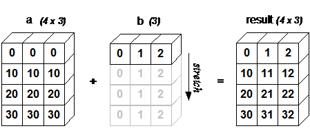
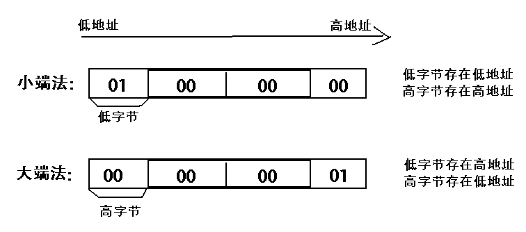
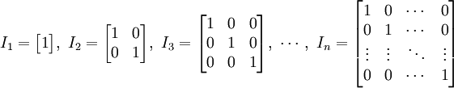
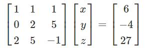

# NumPy Ndarray 对象
ndarray 对象是用于存放同类型元素的多维数组。

ndarray 中的每个元素在内存中都有相同存储大小的区域。

ndarray 内部由以下内容组成：

- 一个指向数据（内存或内存映射文件中的一块数据）的指针。

- 数据类型或 dtype，描述在数组中的固定大小值的格子。

- 一个表示数组形状（shape）的元组，表示各维度大小的元组。

- 一个跨度元组（stride），其中的整数指的是为了前进到当前维度下一个元素需要"跨过"的字节数。

ndarray 的内部结构:

跨度可以是负数，这样会使数组在内存中后向移动，切片中 obj[::-1] 或 obj[:,::-1] 就是如此。

创建一个 ndarray 只需调用 NumPy 的 array 函数即可：

`
numpy.array(object, dtype = None, copy = True, order = None, subok = False, ndmin = 0)
`

```
参数说明：

名称	描述
object	数组或嵌套的数列
dtype	数组元素的数据类型，可选
copy	对象是否需要复制，可选
order	创建数组的样式，C为行方向，F为列方向，A为任意方向（默认）
subok	默认返回一个与基类类型一致的数组
ndmin	指定生成数组的最小维度
```
```python
import numpy as np 
a = np.array([1,2,3])  
print (a)

# 多于一个维度  
import numpy as np 
a = np.array([[1,  2],  [3,  4]])  
print (a)

# 最小维度  
import numpy as np 
a = np.array([1, 2, 3, 4, 5], ndmin =  2)  
print (a)

# dtype 参数  
import numpy as np 
a = np.array([1,  2,  3], dtype = complex)  
print (a)
```

# 数据类型
## 数据类型对象 (dtype)
数据类型对象（numpy.dtype 类的实例）用来描述与数组对应的内存区域是如何使用，它描述了数据的以下几个方面：：

* 数据的类型（整数，浮点数或者 Python 对象）
* 数据的大小（例如， 整数使用多少个字节存储）
* 数据的字节顺序（小端法或大端法）
* 在结构化类型的情况下，字段的名称、每个字段的数据类型和每个字段所取的内存块的部分
* 如果数据类型是子数组，那么它的形状和数据类型是什么。

dtype 对象是使用以下语法构造的：
`
numpy.dtype(object, align, copy)`
* object - 要转换为的数据类型对象
* align - 如果为 true，填充字段使其类似 C 的结构体。
* copy - 复制 dtype 对象 ，如果为 false，则是对内置数据类型对象的引用

```python
import numpy as np
# 使用标量类型
dt = np.dtype(np.int32)
print(dt)

import numpy as np
# int8, int16, int32, int64 四种数据类型可以使用字符串 'i1', 'i2','i4','i8' 代替
dt = np.dtype('i4')
print(dt)

import numpy as np
# 字节顺序标注
dt = np.dtype('<i4')
print(dt)

# 首先创建结构化数据类型
import numpy as np
dt = np.dtype([('age',np.int8)]) 
print(dt)

# 将数据类型应用于 ndarray 对象
import numpy as np
dt = np.dtype([('age',np.int8)]) 
a = np.array([(10,),(20,),(30,)], dtype = dt) 
print(a)

# 类型字段名可以用于存取实际的 age 列
import numpy as np
dt = np.dtype([('age',np.int8)]) 
a = np.array([(10,),(20,),(30,)], dtype = dt) 
print(a['age'])

import numpy as np
student = np.dtype([('name','S20'), ('age', 'i1'), ('marks', 'f4')]) 
print(student)

import numpy as np
student = np.dtype([('name','S20'), ('age', 'i1'), ('marks', 'f4')]) 
a = np.array([('abc', 21, 50),('xyz', 18, 75)], dtype = student) 
print(a)
```


```python
#结构化数据类型是通过一个描述字段名称、字段数据类型以及（可选的）字段大小的列表来定义的。例如：
import numpy as np
dt = np.dtype([
    ('name', 'U10'),  # Unicode 字符串，最大长度为 10
    ('age', 'i4'),    # 32 位整数
    ('height', 'f4')  # 32 位浮点数
])
# 在这个例子中，我们定义了一个结构化数据类型 dt，它包含三个字段：'name'、'age' 和 'height'，分别对应于字符串、整数和浮点数类型。
# 
# 创建结构化数组
# 使用定义好的结构化数据类型，您可以创建结构化数组：


data = np.array([
    ('Alice', 25, 1.65),
    ('Bob', 30, 1.75),
    ('Charlie', 35, 1.80)
], dtype=dt)
# 在这个例子中，我们创建了一个结构化数组 data，其中每个元素都是一个具有三个字段的记录。
# 
# 访问结构化数组的字段
# 您可以使用字段名称来访问结构化数组中的数据：


print(data['name'])   # 访问 'name' 字段
print(data['age'])    # 访问 'age' 字段
print(data['height']) # 访问 'height' 字段
# 这将分别输出 data 数组中所有记录的 'name'、'age' 和 'height' 字段的值。
# 
# 修改结构化数组的字段
# 您还可以修改结构化数组中的字段值：


data['age'] += 1  # 为所有记录的 'age' 字段加 1
# 这将把 data 数组中每个记录的 'age' 字段的值增加 1。
# 
# 使用结构化数组
# 结构化数组非常适合处理具有固定模式的复杂数据，如 CSV 文件、数据库查询结果或其他表格数据。您可以使用 NumPy 的强大功能来对这些数据进行高效的计算和分析。

```


```txt
字符	对应类型
b	布尔型
i	(有符号) 整型
u	无符号整型 integer
f	浮点型
c	复数浮点型
m	timedelta（时间间隔）
M	datetime（日期时间）
O	(Python) 对象
S, a	(byte-)字符串
U	Unicode
V	原始数据 (void)
```

# NumPy 数组属性
NumPy 数组的维数称为秩（rank），秩就是轴的数量，即数组的维度，一维数组的秩为 1，二维数组的秩为 2，以此类推。

在 NumPy中，每一个线性的数组称为是一个轴（axis），也就是维度（dimensions）。比如说，二维数组相当于是两个一维数组，其中第一个一维数组中每个元素又是一个一维数组。所以一维数组就是 NumPy 中的轴（axis），第一个轴相当于是底层数组，第二个轴是底层数组里的数组。而轴的数量——秩，就是数组的维数。

很多时候可以声明 axis。axis=0，表示沿着第 0 轴进行操作，即对每一列进行操作；axis=1，表示沿着第1轴进行操作，即对每一行进行操作。

NumPy 的数组中比较重要 ndarray 对象属性有：
```txt
属性	说明
ndarray.ndim	秩，即轴的数量或维度的数量
ndarray.shape	数组的维度，对于矩阵，n 行 m 列
ndarray.size	数组元素的总个数，相当于 .shape 中 n*m 的值
ndarray.dtype	ndarray 对象的元素类型
ndarray.itemsize	ndarray 对象中每个元素的大小，以字节为单位
ndarray.flags	ndarray 对象的内存信息
ndarray.real	ndarray元素的实部
ndarray.imag	ndarray 元素的虚部
ndarray.data	包含实际数组元素的缓冲区，由于一般通过数组的索引获取元素，所以通常不需要使用这个属性。
```
```python
import numpy as np 
 
a = np.arange(24)  
print (a.ndim)             # a 现只有一个维度
# 现在调整其大小
b = a.reshape(2,4,3)  # b 现在拥有三个维度
print (b.ndim)

import numpy as np  
 
a = np.array([[1,2,3],[4,5,6]])  
print (a.shape)

import numpy as np 
 
a = np.array([[1,2,3],[4,5,6]]) 
a.shape =  (3,2)  
print (a)

import numpy as np 
 
a = np.array([[1,2,3],[4,5,6]]) 
b = a.reshape(3,2)  
print (b)

import numpy as np 
#  
# ndarray.itemsize 以字节的形式返回数组中每一个元素的大小。
# 
# 例如，一个元素类型为 float64 的数组 itemsize 属性值为 8(float64 占用 64 个 bits，每个字节长度为 8，所以 64/8，占用 8 个字节），又如，一个元素类型为 complex32 的数组 item 属性为 4（32/8）。


# 数组的 dtype 为 int8（一个字节）  
x = np.array([1,2,3,4,5], dtype = np.int8)  
print (x.itemsize)
 
# 数组的 dtype 现在为 float64（八个字节） 
y = np.array([1,2,3,4,5], dtype = np.float64)  
print (y.itemsize)


```

```txt
ndarray.flags
ndarray.flags 返回 ndarray 对象的内存信息，包含以下属性：

属性	描述
C_CONTIGUOUS (C)	数据是在一个单一的C风格的连续段中
F_CONTIGUOUS (F)	数据是在一个单一的Fortran风格的连续段中
OWNDATA (O)	数组拥有它所使用的内存或从另一个对象中借用它
WRITEABLE (W)	数据区域可以被写入，将该值设置为 False，则数据为只读
ALIGNED (A)	数据和所有元素都适当地对齐到硬件上
UPDATEIFCOPY (U)	这个数组是其它数组的一个副本，当这个数组被释放时，原数组的内容将被更新
```

```python
import numpy as np 
 
x = np.array([1,2,3,4,5])  
print (x.flags)
```
```
  C_CONTIGUOUS : True
  F_CONTIGUOUS : True
  OWNDATA : True
  WRITEABLE : True
  ALIGNED : True
  WRITEBACKIFCOPY : False
  UPDATEIFCOPY : False
  ```

# 创建数组
## numpy.empty
numpy.empty 方法用来创建一个指定形状（shape）、数据类型（dtype）且未初始化的数组：
`numpy.empty(shape, dtype = float, order = 'C')`
```text
参数说明：

参数	描述
shape	数组形状
dtype	数据类型，可选
order	有"C"和"F"两个选项,分别代表，行优先和列优先，在计算机内存中的存储元素的顺序。
```
```python
import numpy as np 
x = np.empty([3,2], dtype = int) 
print (x)
```
注意 − 数组元素为随机值，因为它们未初始化。

## numpy.zeros
创建指定大小的数组，数组元素以 0 来填充：
`numpy.zeros(shape, dtype = float, order = 'C')`
```text
参数说明：

参数	描述
shape	数组形状
dtype	数据类型，可选
order	'C' 用于 C 的行数组，或者 'F' 用于 FORTRAN 的列数组
```
```python
import numpy as np
 
# 默认为浮点数
x = np.zeros(5) 
print(x)
 
# 设置类型为整数
y = np.zeros((5,), dtype = int) 
print(y)
 
# 自定义类型
z = np.zeros((2,2), dtype = [('x', 'i4'), ('y', 'i4')])  
print(z)
```
## numpy.ones
创建指定形状的数组，数组元素以 1 来填充：

`numpy.ones(shape, dtype = None, order = 'C')`
```python
import numpy as np
 
# 默认为浮点数
x = np.ones(5) 
print(x)
 
# 自定义类型
x = np.ones([2,2], dtype = int)
print(x)
```
## numpy.zeros_like
numpy.zeros_like 用于创建一个与给定数组具有相同形状的数组，数组元素以 0 来填充。

numpy.zeros 和 numpy.zeros_like 都是用于创建一个指定形状的数组，其中所有元素都是 0。

它们之间的区别在于：numpy.zeros 可以直接指定要创建的数组的形状，而 numpy.zeros_like 则是创建一个与给定数组具有相同形状的数组。

`numpy.zeros_like(a, dtype=None, order='K', subok=True, shape=None)`
```text

参数	描述
a	给定要创建相同形状的数组
dtype	创建的数组的数据类型
order	数组在内存中的存储顺序，可选值为 'C'（按行优先）或 'F'（按列优先），默认为 'K'（保留输入数组的存储顺序）
subok	是否允许返回子类，如果为 True，则返回一个子类对象，否则返回一个与 a 数组具有相同数据类型和存储顺序的数组
shape	创建的数组的形状，如果不指定，则默认为 a 数组的形状。
```
```python
import numpy as np
 
# 创建一个 3x3 的二维数组
arr = np.array([[1, 2, 3], [4, 5, 6], [7, 8, 9]])
 
# 创建一个与 arr 形状相同的，所有元素都为 0 的数组
zeros_arr = np.zeros_like(arr)
print(zeros_arr)
```
## numpy.ones_like

`numpy.ones_like(a, dtype=None, order='K', subok=True, shape=None)`

# 从已有的数组创建数组
## numpy.asarray
`numpy.asarray(a, dtype = None, order = None)`

```text
参数	描述
a	任意形式的输入参数，可以是，列表, 列表的元组, 元组, 元组的元组, 元组的列表，多维数组
dtype	数据类型，可选
order	可选，有"C"和"F"两个选项,分别代表，行优先和列优先，在计算机内存中的存储元素的顺序。
```
## numpy.frombuffer
numpy.frombuffer 用于实现动态数组。

numpy.frombuffer 接受 buffer 输入参数，以流的形式读入转化成 ndarray 对象。

`numpy.frombuffer(buffer, dtype = float, count = -1, offset = 0)`

```text
参数	描述
buffer	可以是任意对象，会以流的形式读入。
dtype	返回数组的数据类型，可选
count	读取的数据数量，默认为-1，读取所有数据。
offset	读取的起始位置，默认为0。
```
```text
import numpy as np 
 
s =  b'Hello World' 
a = np.frombuffer(s, dtype =  'S1')  
print (a)
```
## numpy.fromiter
numpy.fromiter 方法从可迭代对象中建立 ndarray 对象，返回一维数组。
`numpy.fromiter(iterable, dtype, count=-1)`

```text
参数	描述
iterable	可迭代对象
dtype	返回数组的数据类型
count	读取的数据数量，默认为-1，读取所有数据
```
```python
import numpy as np 
 
# 使用 range 函数创建列表对象  
list=range(5)
it=iter(list)
 
# 使用迭代器创建 ndarray 
x=np.fromiter(it, dtype=float)
print(x)
```

# 从数值范围创建数组
## numpy.arange
numpy 包中的使用 arange 函数创建数值范围并返回 ndarray 对象

`numpy.arange(start, stop, step, dtype)`
```text
参数	描述
start	起始值，默认为0
stop	终止值（不包含）
step	步长，默认为1
dtype	返回ndarray的数据类型，如果没有提供，则会使用输入数据的类型。
```
## numpy.linspace
numpy.linspace 函数用于创建一个一维数组，数组是一个等差数列构成的

`np.linspace(start, stop, num=50, endpoint=True, retstep=False, dtype=None)`
```text
参数	描述
start	序列的起始值
stop	序列的终止值，如果endpoint为true，该值包含于数列中
num	要生成的等步长的样本数量，默认为50
endpoint	该值为 true 时，数列中包含stop值，反之不包含，默认是True。
retstep	如果为 True 时，生成的数组中会显示间距，反之不显示。
```
```python
import numpy as np
a = np.linspace(1,10,10)
print(a)

import numpy as np
a = np.linspace(1,1,10)
print(a)

import numpy as np
 
a = np.linspace(10, 20,  5, endpoint =  False)  
print(a)

import numpy as np
a =np.linspace(1,10,10,retstep= True)
 
print(a)
# 拓展例子
b =np.linspace(1,10,10).reshape([10,1])
print(b)
```
## numpy.logspace 
numpy.logspace 函数用于创建一个于等比数列

`np.logspace(start, stop, num=50, endpoint=True, base=10.0, dtype=None)`

```text
base 参数意思是取对数的时候 log 的下标。

参数	描述
start	序列的起始值为：base ** start
stop	序列的终止值为：base ** stop。如果endpoint为true，该值包含于数列中
num	要生成的等步长的样本数量，默认为50
endpoint	该值为 true 时，数列中中包含stop值，反之不包含，默认是True。
base	对数 log 的底数。
dtype	ndarray 的数据类型
```
```python
import numpy as np
# 默认底数是 10
a = np.logspace(1.0,  2.0, num =  10)  
print (a)
```
输出结果为：
```text
[ 10.           12.91549665     16.68100537      21.5443469  27.82559402      
  35.93813664   46.41588834     59.94842503      77.42636827    100.    ]
```
```python
import numpy as np
a = np.logspace(0,9,10,base=2)
print (a)
```
```text
[  1.   2.   4.   8.  16.  32.  64. 128. 256. 512.]
```

# 切片和索引
ndarray对象的内容可以通过索引或切片来访问和修改，与 Python 中 list 的切片操作一样。

ndarray 数组可以基于 0 - n 的下标进行索引，切片对象可以通过内置的 slice 函数，并设置 start, stop 及 step 参数进行，从原数组中切割出一个新数组。
```python
import numpy as np
 
a = np.arange(10)
s = slice(2,7,2)   # 从索引 2 开始到索引 7 停止，间隔为2
print (a[s])
```
我们也可以通过冒号分隔切片参数 start:stop:step 来进行切片操作：
```python
import numpy as np
 
a = np.arange(10)  
b = a[2:7:2]   # 从索引 2 开始到索引 7 停止，间隔为 2
print(b)
```
多维数组同样适用上述索引提取方法：
```python
import numpy as np
 
a = np.array([[1,2,3],[3,4,5],[4,5,6]])
print(a)
# 从某个索引处开始切割
print('从数组索引 a[1:] 处开始切割')
print(a[1:])
```
切片还可以包括省略号 …，来使选择元组的长度与数组的维度相同。 如果在行位置使用省略号，它将返回包含行中元素的 ndarray。
```python
import numpy as np
 
a = np.array([[1,2,3],[3,4,5],[4,5,6]])  
print (a[...,1])   # 第2列元素
print (a[1,...])   # 第2行元素
print (a[...,1:])  # 第2列及剩下的所有元素
```

# 高级索引
## 整数数组索引
整数数组索引是指使用一个数组来访问另一个数组的元素。这个数组中的每个元素都是目标数组中某个维度上的索引值。

以下实例获取数组中 (0,0)，(1,1) 和 (2,0) 位置处的元素。
```python
import numpy as np 
 
x = np.array([[1,  2],  [3,  4],  [5,  6]]) 
y = x[[0,1,2],  [0,1,0]]  
print (y)
```
以下实例获取了 4X3 数组中的四个角的元素。 行索引是 [0,0] 和 [3,3]，而列索引是 [0,2] 和 [0,2]。
```python
import numpy as np 
 
x = np.array([[  0,  1,  2],[  3,  4,  5],[  6,  7,  8],[  9,  10,  11]])  
print ('我们的数组是：' )
print (x)
print ('\n')
rows = np.array([[0,0],[3,3]]) 
cols = np.array([[0,2],[0,2]]) 
y = x[rows,cols]  
print  ('这个数组的四个角元素是：')
print (y)
```
返回的结果是包含每个角元素的 ndarray 对象。

可以借助切片 : 或 … 与索引数组组合。如下面例子：
```python
import numpy as np
 
a = np.array([[1,2,3], [4,5,6],[7,8,9]])
b = a[1:3, 1:3]
c = a[1:3,[1,2]]
d = a[...,1:]
print(b)
print(c)
print(d)
```
## 布尔索引
我们可以通过一个布尔数组来索引目标数组。

布尔索引通过布尔运算（如：比较运算符）来获取符合指定条件的元素的数组。

以下实例获取大于 5 的元素：
```python
import numpy as np 
 
x = np.array([[  0,  1,  2],[  3,  4,  5],[  6,  7,  8],[  9,  10,  11]])  
print ('我们的数组是：')
print (x)
print ('\n')
# 现在我们会打印出大于 5 的元素  
print  ('大于 5 的元素是：')
print (x[x >  5])
```
以下实例使用了 ~（取补运算符）来过滤 NaN。
```python
import numpy as np 
 
a = np.array([np.nan,  1,2,np.nan,3,4,5])  
print (a[~np.isnan(a)])
```
以下实例演示如何从数组中过滤掉非复数元素。
```python
import numpy as np 
 
a = np.array([1,  2+6j,  5,  3.5+5j])  
print (a[np.iscomplex(a)])
```
## 花式索引
花式索引指的是利用整数数组进行索引。

**花式索引根据索引数组的值作为目标数组的某个轴的下标来取值。**

对于使用一维整型数组作为索引，如果目标是一维数组，那么索引的结果就是对应位置的元素，如果目标是二维数组，那么就是对应下标的行。

花式索引跟切片不一样，它总是将数据复制到新数组中。
```python
import numpy as np

x = np.arange(9)
print(x)
# 一维数组读取指定下标对应的元素
print("-------读取下标对应的元素-------")
x2 = x[[0, 6]] # 使用花式索引
print(x2) 

print(x2[0])
print(x2[1])
```
## 二维数组
```python
import numpy as np 
 
x=np.arange(32).reshape((8,4))
print(x)
# 二维数组读取指定下标对应的行
print("-------读取下标对应的行-------")
print (x[[4,2,1,7]])
```
print (x[[4,2,1,7]]) 输出下表为 4, 2, 1, 7 对应的行
```python
import numpy as np 
 
x=np.arange(32).reshape((8,4))
print (x[[-4,-2,-1,-7]])
```
# 广播
广播(Broadcast)是 numpy 对不同形状(shape)的数组进行数值计算的方式， 对数组的算术运算通常在相应的元素上进行。

如果两个数组 a 和 b 形状相同，即满足 a.shape == b.shape，那么 a*b 的结果就是 a 与 b 数组对应位相乘。这要求维数相同，且各维度的长度相同。

当运算中的 2 个数组的形状不同时，numpy 将自动触发广播机制。如：
```python
import numpy as np 
 
a = np.array([[ 0, 0, 0],
           [10,10,10],
           [20,20,20],
           [30,30,30]])
b = np.array([0,1,2])
print(a + b)
```
当运算中的 2 个数组的形状不同时，numpy 将自动触发广播机制。如：
```python
import numpy as np 
 
a = np.array([[ 0, 0, 0],
           [10,10,10],
           [20,20,20],
           [30,30,30]])
b = np.array([0,1,2])
print(a + b)
```


4x3 的二维数组与长为 3 的一维数组相加，等效于把数组 b 在二维上重复 4 次再运算：
```python
import numpy as np 
 
a = np.array([[ 0, 0, 0],
           [10,10,10],
           [20,20,20],
           [30,30,30]])
b = np.array([1,2,3])
bb = np.tile(b, (4, 1))  # 重复 b 的各个维度
print(a + bb)
```
```text
广播的规则:

让所有输入数组都向其中形状最长的数组看齐，形状中不足的部分都通过在前面加 1 补齐。
输出数组的形状是输入数组形状的各个维度上的最大值。
如果输入数组的某个维度和输出数组的对应维度的长度相同或者其长度为 1 时，这个数组能够用来计算，否则出错。
当输入数组的某个维度的长度为 1 时，沿着此维度运算时都用此维度上的第一组值。
简单理解：对两个数组，分别比较他们的每一个维度（若其中一个数组没有当前维度则忽略），满足：

数组拥有相同形状。
当前维度的值相等。
当前维度的值有一个是 1。
若条件不满足，抛出 "ValueError: frames are not aligned" 异常。
```
# 迭代数组
NumPy 迭代器对象 numpy.nditer 提供了一种灵活访问一个或者多个数组元素的方式。

迭代器最基本的任务的可以完成对数组元素的访问。
```python
import numpy as np
 
a = np.arange(6).reshape(2,3)
print ('原始数组是：')
print (a)
print ('\n')
print ('迭代输出元素：')
for x in np.nditer(a):
    print (x, end=", " )
print ('\n')
```

```python
import numpy as np
 
a = np.arange(6).reshape(2,3)
for x in np.nditer(a.T):
    print (x, end=", " )
print ('\n')
 
for x in np.nditer(a.T.copy(order='C')):
    print (x, end=", " )
print ('\n')
```
```text
输出：
0, 1, 2, 3, 4, 5, 

0, 3, 1, 4, 2, 5, 
```
从上述例子可以看出，a 和 a.T 的遍历顺序是一样的，也就是他们在内存中的存储顺序也是一样的，但是 a.T.copy(order = 'C') 的遍历结果是不同的，那是因为它和前两种的存储方式是不一样的，默认是按行访问。

控制遍历顺序
* for x in np.nditer(a, order='F'):Fortran order，即是列序优先；
* for x in np.nditer(a.T, order='C'):C order，即是行序优先；
```python
import numpy as np
 
a = np.arange(0,60,5) 
a = a.reshape(3,4)  
print ('原始数组是：') 
print (a) 
print ('\n') 
print ('原始数组的转置是：') 
b = a.T 
print (b) 
print ('\n') 
print ('以 C 风格顺序排序：') 
c = b.copy(order='C')  
print (c)
for x in np.nditer(c):  
    print (x, end=", " )
print  ('\n') 
print  ('以 F 风格顺序排序：')
c = b.copy(order='F')  
print (c)
for x in np.nditer(c):  
    print (x, end=", " )
```
```text
原始数组是：
[[ 0  5 10 15]
 [20 25 30 35]
 [40 45 50 55]]


原始数组的转置是：
[[ 0 20 40]
 [ 5 25 45]
 [10 30 50]
 [15 35 55]]


以 C 风格顺序排序：
[[ 0 20 40]
 [ 5 25 45]
 [10 30 50]
 [15 35 55]]
0, 20, 40, 5, 25, 45, 10, 30, 50, 15, 35, 55, 

以 F 风格顺序排序：
[[ 0 20 40]
 [ 5 25 45]
 [10 30 50]
 [15 35 55]]
0, 5, 10, 15, 20, 25, 30, 35, 40, 45, 50, 55,
```
可以通过显式设置，来强制 nditer 对象使用某种顺序：
```python
import numpy as np 
 
a = np.arange(0,60,5) 
a = a.reshape(3,4)  
print ('原始数组是：')
print (a)
print ('\n')
print ('以 C 风格顺序排序：')
for x in np.nditer(a, order =  'C'):  
    print (x, end=", " )
print ('\n')
print ('以 F 风格顺序排序：')
for x in np.nditer(a, order =  'F'):  
    print (x, end=", " )
```

## 修改数组中元素的值
nditer 对象有另一个可选参数 op_flags。 默认情况下，nditer 将视待迭代遍历的数组为只读对象（read-only），为了在遍历数组的同时，实现对数组元素值的修改，必须指定 readwrite 或者 writeonly 的模式。
```python
import numpy as np
 
a = np.arange(0,60,5) 
a = a.reshape(3,4)  
print ('原始数组是：')
print (a)
print ('\n')
for x in np.nditer(a, op_flags=['readwrite']): 
    x[...]=2*x 
print ('修改后的数组是：')
print (a)
```
## 使用外部循环
```text
nditer 类的构造器拥有 flags 参数，它可以接受下列值：

参数	描述
c_index	可以跟踪 C 顺序的索引
f_index	可以跟踪 Fortran 顺序的索引
multi_index	每次迭代可以跟踪一种索引类型
external_loop	给出的值是具有多个值的一维数组，而不是零维数组
```
```python
import numpy as np 
a = np.arange(0,60,5) 
a = a.reshape(3,4)  
print ('原始数组是：')
print (a)
print ('\n')
print ('修改后的数组是：')
for x in np.nditer(a, flags =  ['external_loop'], order =  'F'):  
   print (x, end=", " )
```
## 广播迭代
如果两个数组是可广播的，nditer 组合对象能够同时迭代它们。 假设数组 a 的维度为 3X4，数组 b 的维度为 1X4 ，则使用以下迭代器（数组 b 被广播到 a 的大小）。
```python
import numpy as np 
 
a = np.arange(0,60,5) 
a = a.reshape(3,4)  
print  ('第一个数组为：')
print (a)
print  ('\n')
print ('第二个数组为：')
b = np.array([1,  2,  3,  4], dtype =  int)  
print (b)
print ('\n')
print ('修改后的数组为：')
for x,y in np.nditer([a,b]):  
    print ("%d:%d"  %  (x,y), end=", " )
```

# 数组操作
## 修改数组形状
```text

函数	描述
reshape	 不改变数据的条件下修改形状
flat	 数组元素迭代器
flatten	 返回一份数组拷贝，对拷贝所做的修改不会影响原始数组
ravel	 返回展开数组
```
### numpy.reshape
numpy.reshape 函数可以在不改变数据的条件下修改形状，格式如下：
`numpy.reshape(arr, newshape, order='C')`

* arr：要修改形状的数组
* newshape：整数或者整数数组，新的形状应当兼容原有形状
* order：'C' -- 按行，'F' -- 按列，'A' -- 原顺序，'k' -- 元素在内存中的出现顺序。

```python
import numpy as np
 
a = np.arange(8)
print ('原始数组：')
print (a)
print ('\n')
 
b = a.reshape(4,2)
print ('修改后的数组：')
print (b)
```
### numpy.ndarray.flat
```python
import numpy as np
 
a = np.arange(9).reshape(3,3) 
print ('原始数组：')
for row in a:
    print (row)
 
#对数组中每个元素都进行处理，可以使用flat属性，该属性是一个数组元素迭代器：
print ('迭代后的数组：')
for element in a.flat:
    print (element)
```
### numpy.ndarray.flatten
numpy.ndarray.flatten 返回一份数组拷贝，对拷贝所做的修改不会影响原始数组，格式如下：

`ndarray.flatten(order='C')`
* order：'C' -- 按行，'F' -- 按列，'A' -- 原顺序，'K' -- 元素在内存中的出现顺序。

### numpy.ravel
`numpy.ravel(a, order='C')`
```text
import numpy as np
 
a = np.arange(8).reshape(2,4)
 
print ('原数组：')
print (a)
print ('\n')
 
print ('调用 ravel 函数之后：')
print (a.ravel())
print ('\n')
 
print ('以 F 风格顺序调用 ravel 函数之后：')
print (a.ravel(order = 'F'))
```
## 翻转数组
```text
函数	描述
transpose	对换数组的维度
ndarray.T	和 self.transpose() 相同
rollaxis	向后滚动指定的轴
swapaxes	对换数组的两个轴
```
```python
# numpy.transpose(arr, axes) 转置

# 参数说明:
# 
# arr：要操作的数组
# axes：整数列表，对应维度，通常所有维度都会对换。

import numpy as np
 
a = np.arange(12).reshape(3,4)
 
print ('原数组：')
print (a )
print ('\n')
 
print ('对换数组：')
print (np.transpose(a))

import numpy as np
 
a = np.arange(12).reshape(3,4)
 
print ('原数组：')
print (a)
print ('\n')
 
print ('转置数组：')
print (a.T)

#------------------------------------------------------------------------

#numpy.swapaxes

# numpy.swapaxes(arr, axis1, axis2)
# arr：输入的数组
# axis1：对应第一个轴的整数
# axis2：对应第二个轴的整数

import numpy as np
 
# 创建了三维的 ndarray
a = np.arange(8).reshape(2,2,2)
 
print ('原数组：')
print (a)
print ('\n')
# 现在交换轴 0（深度方向）到轴 2（宽度方向）
 
print ('调用 swapaxes 函数后的数组：')
print (np.swapaxes(a, 2, 0))
```
## 修改数组维度
pass


# 位运算
位运算是一种在二进制数字的位级别上进行操作的一类运算，它们直接操作二进制数字的各个位，而不考虑数字的整体值。

位运算在计算机科学中广泛应用于优化和处理底层数据。

NumPy "bitwise_" 开头的函数是位运算函数。

```text
函数	描述
bitwise_and	按位与，对数组元素执行位与操作
bitwise_or	按位或，对数组元素执行位或操作
bitwise_xor	按位异或
bitwise_not	按位取反
invert	        按位取反
left_shift	左移位运算，向左移动二进制表示的位
right_shift	右移位运算，向右移动二进制表示的位
```
```python
import numpy as np

arr1 = np.array([True, False, True], dtype=bool)
arr2 = np.array([False, True, False], dtype=bool)

result_and = np.bitwise_and(arr1, arr2)
result_or = np.bitwise_or(arr1, arr2)
result_xor = np.bitwise_xor(arr1, arr2)
result_not = np.bitwise_not(arr1)

print("AND:", result_and)  # [False, False, False]
print("OR:", result_or) # [True, True, True]
print("XOR:", result_xor) # [True, True, True]
print("NOT:", result_not) # [False, True, False]

# 按位取反
arr_invert = np.invert(np.array([1, 2], dtype=np.int8))
print("Invert:", arr_invert) # [-2, -3]

# 左移位运算
arr_left_shift = np.left_shift(5, 2)
print("Left Shift:", arr_left_shift) # 20

# 右移位运算
arr_right_shift = np.right_shift(10, 1)
print("Right Shift:", arr_right_shift) # 5
```
```text
也可以使用 "&"、 "~"、 "|" 和 "^" 等操作符进行计算：

与运算（&）： 对应位上的两个数字都为1时，结果为1；否则，结果为0。

例如：1010 & 1100 = 1000

或运算（|）： 对应位上的两个数字有一个为1时，结果为1；否则，结果为0。

例如：1010 | 1100 = 1110

异或运算（^）： 对应位上的两个数字相异时，结果为1；相同时，结果为0。

例如：1010 ^ 1100 = 0110

取反运算（~）： 对数字的每个位取反，即0变为1，1变为0。

例如：~1010 = 0101

左移运算（<<）： 将数字的所有位向左移动指定的位数，右侧用0填充。

例如：1010 << 2 = 101000

右移运算（>>）： 将数字的所有位向右移动指定的位数，左侧根据符号位或补零。

例如：1010 >> 2 = 0010
```

# 字符串函数
以下函数用于对 dtype 为 numpy.string_ 或 numpy.unicode_ 的数组执行向量化字符串操作。 它们基于 Python 内置库中的标准字符串函数。
```text

函数	描述
add()	对两个数组的逐个字符串元素进行连接
multiply()	返回按元素多重连接后的字符串
center()	居中字符串
capitalize()	将字符串第一个字母转换为大写
title()	将字符串的每个单词的第一个字母转换为大写
lower()	数组元素转换为小写
upper()	数组元素转换为大写
split()	指定分隔符对字符串进行分割，并返回数组列表
splitlines()	返回元素中的行列表，以换行符分割
strip()	移除元素开头或者结尾处的特定字符
join()	通过指定分隔符来连接数组中的元素
replace()	使用新字符串替换字符串中的所有子字符串
decode()	数组元素依次调用str.decode
encode()	数组元素依次调用str.encode
```
```python
import numpy as np 
 
print ('连接两个字符串：')
print (np.char.add(['hello'],[' xyz']))
print ('\n')
 
print ('连接示例：')
print (np.char.add(['hello', 'hi'],[' abc', ' xyz']))


import numpy as np 
 
print (np.char.multiply('Runoob ',3))


import numpy as np 
 
print (np.char.multiply('Runoob ',3))


import numpy as np 
 
print (np.char.capitalize('runoob'))

import numpy as np
 
print (np.char.title('i like runoob'))


import numpy as np 
 
#操作数组
print (np.char.lower(['RUNOOB','GOOGLE']))
 
# 操作字符串
print (np.char.lower('RUNOOB'))


import numpy as np 
 
#操作数组
print (np.char.upper(['runoob','google']))
 
# 操作字符串
print (np.char.upper('runoob'))


import numpy as np 
 # numpy.char.split() 通过指定分隔符对字符串进行分割，并返回数组。默认情况下，分隔符为空格。
# 分隔符默认为空格
print (np.char.split ('i like runoob?'))
# 分隔符为 .
print (np.char.split ('www.runoob.com', sep = '.'))


import numpy as np 
 # numpy.char.splitlines() 函数以换行符作为分隔符来分割字符串，并返回数组。
 # \n，\r，\r\n 都可用作换行符。
 
# 换行符 \n
print (np.char.splitlines('i\nlike runoob?')) 
print (np.char.splitlines('i\rlike runoob?'))

import numpy as np 
#numpy.char.strip() 函数用于移除开头或结尾处的特定字符。 

# 移除字符串头尾的 a 字符
print (np.char.strip('ashok arunooba','a'))
 
# 移除数组元素头尾的 a 字符
print (np.char.strip(['arunooba','admin','java'],'a'))


import numpy as np 
 
#numpy.char.join() 函数通过指定分隔符来连接数组中的元素或字符串

# 操作字符串
print (np.char.join(':','runoob'))
 
# 指定多个分隔符操作数组元素
print (np.char.join([':','-'],['runoob','google']))

import numpy as np 
# numpy.char.replace() 函数使用新字符串替换字符串中的所有子字符串。
print (np.char.replace ('i like runoob', 'oo', 'cc'))


import numpy as np 
 #numpy.char.encode() 函数对数组中的每个元素调用 str.encode 函数。 默认编码是 utf-8，可以使用标准 Python 库中的编解码器。
 
a = np.char.encode('runoob', 'cp500') 
print (a)


import numpy as np 
 #numpy.char.decode() 函数对编码的元素进行 str.decode() 解码。
a = np.char.encode('runoob', 'cp500') 
print (a)
print (np.char.decode(a,'cp500'))
# 
# 在这个例子中，np.char.encode 函数用于将字符串按照指定的编码方式进行编码，而 np.char.decode 函数用于将编码后的字符串按照指定的编码方式进行解码。
# 
# 'cp500' 是一种编码方式，也被称为 EBCDIC 编码，它是一种用于大型计算机系统的字符编码。
# 
# 代码解释：
# 
# a = np.char.encode('runoob', 'cp500'): 将字符串 'runoob' 按照 'cp500' 编码方式进行编码，赋值给变量 a。
# print(a): 打印编码后的结果。
# print(np.char.decode(a,'cp500')): 将变量 a 中的编码字符串按照 'cp500' 编码方式进行解码，然后打印解码后的结果。
# 运行结果将显示编码后的字符串以及解码后恢复的原始字符串 'runoob'。
```
# 数学函数
## 三角函数
```python

import numpy as np
 
a = np.array([0,30,45,60,90])
print ('不同角度的正弦值：')
# 通过乘 pi/180 转化为弧度  
print (np.sin(a*np.pi/180))
print ('\n')
print ('数组中角度的余弦值：')
print (np.cos(a*np.pi/180))
print ('\n')
print ('数组中角度的正切值：')
print (np.tan(a*np.pi/180))


import numpy as np
 
a = np.array([0,30,45,60,90])  
print ('含有正弦值的数组：')
sin = np.sin(a*np.pi/180)  
print (sin)
print ('\n')
print ('计算角度的反正弦，返回值以弧度为单位：')
inv = np.arcsin(sin)  
print (inv)
print ('\n')
print ('通过转化为角度制来检查结果：')
print (np.degrees(inv))
print ('\n')
print ('arccos 和 arctan 函数行为类似：')
cos = np.cos(a*np.pi/180)  
print (cos)
print ('\n')
print ('反余弦：')
inv = np.arccos(cos)  
print (inv)
print ('\n')
print ('角度制单位：')
print (np.degrees(inv))
print ('\n')
print ('tan 函数：')
tan = np.tan(a*np.pi/180)  
print (tan)
print ('\n')
print ('反正切：')
inv = np.arctan(tan)  
print (inv)
print ('\n')
print ('角度制单位：')
print (np.degrees(inv))
```
## 舍入函数
`numpy.around(a,decimals)`

* a: 数组
* decimals: 舍入的小数位数。 默认值为0。 如果为负，整数将四舍五入到小数点左侧的位置
```python
import numpy as np
 
a = np.array([1.0,5.55,  123,  0.567,  25.532])  
print  ('原数组：')
print (a)
print ('\n')
print ('舍入后：')
print (np.around(a))
print (np.around(a, decimals =  1))
print (np.around(a, decimals =  -1))
```
### numpy.floor()
```python
import numpy as np
 
a = np.array([-1.7,  1.5,  -0.2,  0.6,  10])
print ('提供的数组：')
print (a)
print ('\n')
print ('修改后的数组：')
print (np.floor(a))
```
### numpy.ceil()
```python
import numpy as np
 
a = np.array([-1.7,  1.5,  -0.2,  0.6,  10])  
print  ('提供的数组：')
print (a)
print ('\n')
print ('修改后的数组：')
print (np.ceil(a))
```

# 算术函数
NumPy 算术函数包含简单的加减乘除: add()，subtract()，multiply() 和 divide()。
```python
import numpy as np 
 
a = np.arange(9, dtype = np.float_).reshape(3,3)  
print ('第一个数组：')
print (a)
print ('\n')
print ('第二个数组：')
b = np.array([10,10,10])  
print (b)
print ('\n')
print ('两个数组相加：')
print (np.add(a,b))
print ('\n')
print ('两个数组相减：')
print (np.subtract(a,b))
print ('\n')
print ('两个数组相乘：')
print (np.multiply(a,b))
print ('\n')
print ('两个数组相除：')
print (np.divide(a,b))
```
## numpy.reciprocal()
numpy.reciprocal() 函数返回参数逐元素的倒数。如 1/4 倒数为 4/1。
```python
import numpy as np 
 
a = np.array([0.25,  1.33,  1,  100])  
print ('我们的数组是：')
print (a)
print ('\n')
print ('调用 reciprocal 函数：')
print (np.reciprocal(a))
```

## numpy.power()
numpy.power() 函数将第一个输入数组中的元素作为底数，计算它与第二个输入数组中相应元素的幂
```python
import numpy as np 
 
a = np.array([10,100,1000])  
print ('我们的数组是；')
print (a)
print ('\n') 
print ('调用 power 函数：')
print (np.power(a,2))
print ('\n')
print ('第二个数组：')
b = np.array([1,2,3])  
print (b)
print ('\n')
print ('再次调用 power 函数：')
print (np.power(a,b))
```
## numpy.mod()
numpy.mod() 计算输入数组中相应元素的相除后的余数。 函数 numpy.remainder() 也产生相同的结果。
```python
import numpy as np
 
a = np.array([10,20,30]) 
b = np.array([3,5,7])  
print ('第一个数组：')
print (a)
print ('\n')
print ('第二个数组：')
print (b)
print ('\n')
print ('调用 mod() 函数：')
print (np.mod(a,b))
print ('\n')
print ('调用 remainder() 函数：')
print (np.remainder(a,b))
```
# 统计函数
NumPy 提供了很多统计函数，用于从数组中查找最小元素，最大元素，百分位标准差和方差等。

numpy.amin() 和 numpy.amax()
numpy.amin() 用于计算数组中的元素沿指定轴的最小值。
`numpy.amin(a, axis=None, out=None, keepdims=<no value>, initial=<no value>, where=<no value>)`

```text
参数说明：

a: 输入的数组，可以是一个NumPy数组或类似数组的对象。
axis: 可选参数，用于指定在哪个轴上计算最小值。如果不提供此参数，则返回整个数组的最小值。可以是一个整数表示轴的索引，也可以是一个元组表示多个轴。
out: 可选参数，用于指定结果的存储位置。
keepdims: 可选参数，如果为True，将保持结果数组的维度数目与输入数组相同。如果为False（默认值），则会去除计算后维度为1的轴。
initial: 可选参数，用于指定一个初始值，然后在数组的元素上计算最小值。
where: 可选参数，一个布尔数组，用于指定仅考虑满足条件的元素。
```
numpy.amax() 用于计算数组中的元素沿指定轴的最大值。
`numpy.amax(a, axis=None, out=None, keepdims=<no value>, initial=<no value>, where=<no value>)`

```python
import numpy as np 
 
a = np.array([[3,7,5],[8,4,3],[2,4,9]])  
print ('我们的数组是：')
print (a)
print ('\n')
print ('调用 amin() 函数：')
print (np.amin(a,1))
print ('\n')
print ('再次调用 amin() 函数：')
print (np.amin(a,0))
print ('\n')
print ('调用 amax() 函数：')
print (np.amax(a))
print ('\n')
print ('再次调用 amax() 函数：')
print (np.amax(a, axis =  0))
```

## numpy.ptp()
numpy.ptp() 函数计算数组中元素最大值与最小值的差（最大值 - 最小值）。
`numpy.ptp(a, axis=None, out=None, keepdims=<no value>, initial=<no value>, where=<no value>)`

```text
参数说明：

a: 输入的数组，可以是一个 NumPy 数组或类似数组的对象。
axis: 可选参数，用于指定在哪个轴上计算峰-峰值。如果不提供此参数，则返回整个数组的峰-峰值。可以是一个整数表示轴的索引，也可以是一个元组表示多个轴。
out: 可选参数，用于指定结果的存储位置。
keepdims: 可选参数，如果为 True，将保持结果数组的维度数目与输入数组相同。如果为 False（默认值），则会去除计算后维度为1的轴。
initial: 可选参数，用于指定一个初始值，然后在数组的元素上计算峰-峰值。
where: 可选参数，一个布尔数组，用于指定仅考虑满足条件的元素。
```

```python
import numpy as np 
 
a = np.array([[3,7,5],[8,4,3],[2,4,9]])  
print ('我们的数组是：')
print (a)
print ('\n')
print ('调用 ptp() 函数：')
print (np.ptp(a))
print ('\n')
print ('沿轴 1 调用 ptp() 函数：')
print (np.ptp(a, axis =  1))
print ('\n')
print ('沿轴 0 调用 ptp() 函数：')
print (np.ptp(a, axis =  0))
```
## numpy.percentile()
百分位数是统计中使用的度量，表示小于这个值的观察值的百分比。 函数numpy.percentile()接受以下参数。
`numpy.percentile(a, q, axis)`

```text
参数说明：

a: 输入数组
q: 要计算的百分位数，在 0 ~ 100 之间
axis: 沿着它计算百分位数的轴
首先明确百分位数：

第 p 个百分位数是这样一个值，它使得至少有 p% 的数据项小于或等于这个值，且至少有 (100-p)% 的数据项大于或等于这个值。

举个例子：高等院校的入学考试成绩经常以百分位数的形式报告。比如，假设某个考生在入学考试中的语文部分的原始分数为 54 分。相对于参加同一考试的其他学生来说，他的成绩如何并不容易知道。但是如果原始分数54分恰好对应的是第70百分位数，我们就能知道大约70%的学生的考分比他低，而约30%的学生考分比他高。

这里的 p = 70。
```

```python
import numpy as np 
 
a = np.array([[10, 7, 4], [3, 2, 1]])
print ('我们的数组是：')
print (a)
 
print ('调用 percentile() 函数：')
# 50% 的分位数，就是 a 里排序之后的中位数
print (np.percentile(a, 50)) 
 
# axis 为 0，在纵列上求
print (np.percentile(a, 50, axis=0)) 
 
# axis 为 1，在横行上求
print (np.percentile(a, 50, axis=1)) 
 
# 保持维度不变
print (np.percentile(a, 50, axis=1, keepdims=True))
```

## numpy.median()
numpy.median() 函数用于计算数组 a 中元素的中位数（中值）
`numpy.median(a, axis=None, out=None, overwrite_input=False, keepdims=<no value>)`

```text
参数说明：

a: 输入的数组，可以是一个 NumPy 数组或类似数组的对象。
axis: 可选参数，用于指定在哪个轴上计算中位数。如果不提供此参数，则计算整个数组的中位数。可以是一个整数表示轴的索引，也可以是一个元组表示多个轴。
out: 可选参数，用于指定结果的存储位置。
overwrite_input: 可选参数，如果为True，则允许在计算中使用输入数组的内存。这可能会在某些情况下提高性能，但可能会修改输入数组的内容。
keepdims: 可选参数，如果为True，将保持结果数组的维度数目与输入数组相同。如果为False（默认值），则会去除计算后维度为1的轴。
```
## numpy.mean()
numpy.mean() 函数返回数组中元素的算术平均值，如果提供了轴，则沿其计算。

算术平均值是沿轴的元素的总和除以元素的数量。
`numpy.mean(a, axis=None, dtype=None, out=None, keepdims=<no value>)`

## numpy.average()
numpy.average() 函数根据在另一个数组中给出的各自的权重计算数组中元素的加权平均值。

该函数可以接受一个轴参数。 如果没有指定轴，则数组会被展开。

加权平均值即将各数值乘以相应的权数，然后加总求和得到总体值，再除以总的单位数。

考虑数组[1,2,3,4]和相应的权重[4,3,2,1]，通过将相应元素的乘积相加，并将和除以权重的和，来计算加权平均值。

`加权平均值 = (1*4+2*3+3*2+4*1)/(4+3+2+1)`

`numpy.average(a, axis=None, weights=None, returned=False)`
```text
参数说明：

a: 输入的数组，可以是一个 NumPy 数组或类似数组的对象。
axis: 可选参数，用于指定在哪个轴上计算加权平均值。如果不提供此参数，则计算整个数组的加权平均值。可以是一个整数表示轴的索引，也可以是一个元组表示多个轴。
weights: 可选参数，用于指定对应数据点的权重。如果不提供权重数组，则默认为等权重。
returned: 可选参数，如果为True，将同时返回加权平均值和权重总和。
```

```python
import numpy as np 
 
a = np.array([1,2,3,4])  
print ('我们的数组是：')
print (a)
print ('\n')
print ('调用 average() 函数：')
print (np.average(a))
print ('\n')
# 不指定权重时相当于 mean 函数
wts = np.array([4,3,2,1])  
print ('再次调用 average() 函数：')
print (np.average(a,weights = wts))
print ('\n')
# 如果 returned 参数设为 true，则返回权重的和  
print ('权重的和：')
print (np.average([1,2,3,  4],weights =  [4,3,2,1], returned =  True))
```
在多维数组中，可以指定用于计算的轴。
```python
import numpy as np 
 
a = np.arange(6).reshape(3,2)  
print ('我们的数组是：')
print (a)
print ('\n')
print ('修改后的数组：')
wt = np.array([3,5])  
print (np.average(a, axis =  1, weights = wt))
print ('\n')
print ('修改后的数组：')
print (np.average(a, axis =  1, weights = wt, returned =  True))
```

## 标准差
标准差是一组数据平均值分散程度的一种度量。

标准差是方差的算术平方根。

标准差公式如下：
`std = sqrt(mean((x - x.mean())**2))`
如果数组是 [1，2，3，4]，则其平均值为 2.5。 因此，差的平方是 [2.25,0.25,0.25,2.25]，并且再求其平均值的平方根除以 4，即 sqrt(5/4) ，结果为 1.1180339887498949。

```python
import numpy as np 
 
print (np.std([1,2,3,4]))
```
## 方差
统计中的方差（样本方差）是每个样本值与全体样本值的平均数之差的平方值的平均数，即 mean((x - x.mean())** 2)。

换句话说，标准差是方差的平方根。
```python
import numpy as np
 
print (np.var([1,2,3,4]))
```

# 排序、条件筛选函数
```text
种类	                速度	最坏情况	     工作空间   稳定性
'quicksort'（快速排序）	1	O(n^2)	         0	否
'mergesort'（归并排序）	2	O(n*log(n))	~n/2	是
'heapsort'（堆排序）	3	O(n*log(n))	  0	否
```
## numpy.sort()
numpy.sort() 函数返回输入数组的排序副本。函数格式如下：
`numpy.sort(a, axis, kind, order)`
```text
参数说明：

a: 要排序的数组
axis: 沿着它排序数组的轴，如果没有数组会被展开，沿着最后的轴排序， axis=0 按列排序，axis=1 按行排序
kind: 默认为'quicksort'（快速排序）
order: 如果数组包含字段，则是要排序的字段
```

```python
import numpy as np  
 
a = np.array([[3,7],[9,1]])  
print ('我们的数组是：')
print (a)
print ('\n')
print ('调用 sort() 函数：')
print (np.sort(a))
print ('\n')
print ('按列排序：')
print (np.sort(a, axis =  0))
print ('\n')
# 在 sort 函数中排序字段 
dt = np.dtype([('name',  'S10'),('age',  int)]) 
a = np.array([("raju",21),("anil",25),("ravi",  17),  ("amar",27)], dtype = dt)  
print ('我们的数组是：')
print (a)
print ('\n')
print ('按 name 排序：')
print (np.sort(a, order =  'name'))
```

## numpy.argsort()
numpy.argsort() 函数返回的是数组值从小到大的索引值。

```python
import numpy as np 
 
x = np.array([3,  1,  2])  
print ('我们的数组是：')
print (x)
print ('\n')
print ('对 x 调用 argsort() 函数：')
y = np.argsort(x)  
print (y)
print ('\n')
print ('以排序后的顺序重构原数组：')
print (x[y])
print ('\n')
print ('使用循环重构原数组：')
for i in y:  
    print (x[i], end=" ")
```

## numpy.lexsort()
numpy.lexsort() 用于对多个序列进行排序。把它想象成对电子表格进行排序，每一列代表一个序列，排序时优先照顾靠后的列。

这里举一个应用场景：小升初考试，重点班录取学生按照总成绩录取。在总成绩相同时，数学成绩高的优先录取，在总成绩和数学成绩都相同时，按照英语成绩录取…… 这里，总成绩排在电子表格的最后一列，数学成绩在倒数第二列，英语成绩在倒数第三列。
```python
import numpy as np 
 
nm =  ('raju','anil','ravi','amar') 
dv =  ('f.y.',  's.y.',  's.y.',  'f.y.') 
ind = np.lexsort((dv,nm))  
print ('调用 lexsort() 函数：') 
print (ind) 
print ('\n') 
print ('使用这个索引来获取排序后的数据：') 
print ([nm[i]  +  ", "  + dv[i]  for i in ind])

```
当您使用 np.lexsort((a, b, c, d)) 时，排序的逻辑是这样的：

首先根据 d 对所有元素进行排序。
在 d 相等的元素中，再根据 c 进行排序。
在 d 和 c 都相等的元素中，再根据 b 进行排序。
最后，在 d、c 和 b 都相等的元素中，根据 a 进行排序。
因此，np.lexsort((a, b, c, d)) 并不是先对 a、b、c、d 全部进行排序，而是按照 d、c、b、a 的顺序依次对相等元素进行排序。换句话说，d 是首要排序键，c 是次要排序键，依此类推，直到 a。

```python
import numpy as np

# 定义两个数组，分别表示学生的姓名和分数
names = np.array(['Alice', 'Bob', 'Charlie', 'David'])
scores = np.array([90, 80, 85, 80])

# 使用 lexsort() 对学生进行排序
# 首先根据分数（scores）排序，然后在分数相同的情况下根据姓名（names）排序
sorted_indices = np.lexsort((names, scores))

# 使用排序后的索引数组对姓名和分数进行排序
sorted_names = names[sorted_indices]
sorted_scores = scores[sorted_indices]

# 打印排序结果
print("Sorted names:", sorted_names)
print("Sorted scores:", sorted_scores)

```

## msort、sort_complex、partition、argpartition


```text
函数	                                        描述
msort(a)	                                数组按第一个轴排序，返回排序后的数组副本。np.msort(a) 相等于 np.sort(a, axis=0)。
sort_complex(a)	                                对复数按照先实部后虚部的顺序进行排序。
partition(a, kth[, axis, kind, order])	        指定一个数，对数组进行分区
argpartition(a, kth[, axis, kind, order])	可以通过关键字 kind 指定算法沿着指定轴对数组进行分区
```
```text
复数排序：
>>> import numpy as np
>>> np.sort_complex([5, 3, 6, 2, 1])
array([ 1.+0.j,  2.+0.j,  3.+0.j,  5.+0.j,  6.+0.j])
>>>
>>> np.sort_complex([1 + 2j, 2 - 1j, 3 - 2j, 3 - 3j, 3 + 5j])
array([ 1.+2.j,  2.-1.j,  3.-3.j,  3.-2.j,  3.+5.j])

partition() 分区排序：
>>> a = np.array([3, 4, 2, 1])
>>> np.partition(a, 3)  # 将数组 a 中所有元素（包括重复元素）从小到大排列，3 表示的是排序数组索引为 3 的数字，比该数字小的排在该数字前面，比该数字大的排在该数字的后面
array([2, 1, 3, 4])
>>>
>>> np.partition(a, (1, 3)) # 小于 1 的在前面，大于 3 的在后面，1和3之间的在中间
array([1, 2, 3, 4])

找到数组的第 3 小（index=2）的值和第 2 大（index=-2）的值
>>> arr = np.array([46, 57, 23, 39, 1, 10, 0, 120])
>>> arr[np.argpartition(arr, 2)[2]]
10
>>> arr[np.argpartition(arr, -2)[-2]]
57

同时找到第 3 和第 4 小的值。注意这里，用 [2,3] 同时将第 3 和第 4 小的排序好，然后可以分别通过下标 [2] 和 [3] 取得。
>>> arr[np.argpartition(arr, [2,3])[2]]
10
>>> arr[np.argpartition(arr, [2,3])[3]]
23


```

## numpy.argmax() 和 numpy.argmin()
numpy.argmax() 和 numpy.argmin()函数分别沿给定轴返回最大和最小元素的索引。
```python
import numpy as np 
 
a = np.array([[30,40,70],[80,20,10],[50,90,60]])  
print  ('我们的数组是：') 
print (a) 
print ('\n') 
print ('调用 argmax() 函数：') 
print (np.argmax(a)) 
print ('\n') 
print ('展开数组：') 
print (a.flatten()) 
print ('\n') 
print ('沿轴 0 的最大值索引：') 
maxindex = np.argmax(a, axis =  0)  
print (maxindex) 
print ('\n') 
print ('沿轴 1 的最大值索引：') 
maxindex = np.argmax(a, axis =  1)  
print (maxindex) 
print ('\n') 
print ('调用 argmin() 函数：') 
minindex = np.argmin(a)  
print (minindex) 
print ('\n') 
print ('展开数组中的最小值：') 
print (a.flatten()[minindex]) 
print ('\n') 
print ('沿轴 0 的最小值索引：') 
minindex = np.argmin(a, axis =  0)  
print (minindex) 
print ('\n') 
print ('沿轴 1 的最小值索引：') 
minindex = np.argmin(a, axis =  1)  
print (minindex)
```

## numpy.nonzero()
numpy.nonzero() 函数返回输入数组中非零元素的索引。
```python
import numpy as np 
 
a = np.array([[30,40,0],[0,20,10],[50,0,60]])  
print ('我们的数组是：')
print (a)
print ('\n')
print ('调用 nonzero() 函数：')
print (np.nonzero (a))
```

## numpy.where()
numpy.where() 函数返回输入数组中满足给定条件的元素的索引。
```python
import numpy as np 
 
x = np.arange(9.).reshape(3,  3)  
print ('我们的数组是：')
print (x)
print ( '大于 3 的元素的索引：')
y = np.where(x >  3)  
print (y)
print ('使用这些索引来获取满足条件的元素：')
print (x[y])
```

## numpy.extract()
numpy.extract() 函数根据某个条件从数组中抽取元素，返回满条件的元素。
```python
import numpy as np 
 
x = np.arange(9.).reshape(3,  3)  
print ('我们的数组是：')
print (x)
# 定义条件, 选择偶数元素
condition = np.mod(x,2)  ==  0  
print ('按元素的条件值：')
print (condition)
print ('使用条件提取元素：')
print (np.extract(condition, x))
```

# 字节交换
几乎所有的机器上，多字节对象都被存储为连续的字节序列。字节顺序，是跨越多字节的程序对象的存储规则。

* 大端模式：指数据的高字节保存在内存的低地址中，而数据的低字节保存在内存的高地址中，这样的存储模式有点儿类似于把数据当作字符串顺序处理：地址由小向大增加，而数据从高位往低位放；这和我们的阅读习惯一致。

* 小端模式：指数据的高字节保存在内存的高地址中，而数据的低字节保存在内存的低地址中，这种存储模式将地址的高低和数据位权有效地结合起来，高地址部分权值高，低地址部分权值低。

例如在 C 语言中，一个类型为 int 的变量 x 地址为 0x100，那么其对应地址表达式&x的值为 0x100。且x的四个字节将被存储在存储器的 0x100, 0x101, 0x102, 0x103位置。


```python
import numpy as np 
 
a = np.array([1,  256,  8755], dtype = np.int16)  
print ('我们的数组是：')
print (a)
print ('以十六进制表示内存中的数据：')
print (map(hex,a))
# byteswap() 函数通过传入 true 来原地交换 
print ('调用 byteswap() 函数：')
print (a.byteswap(True))
print ('十六进制形式：')
print (map(hex,a))
# 我们可以看到字节已经交换了
```
```text
我们的数组是：
[   1  256 8755]
以十六进制表示内存中的数据：
<map object at 0x104acb400>
调用 byteswap() 函数：
[  256     1 13090]
十六进制形式：
<map object at 0x104acb3c8>
```
# 副本和视图
副本是一个数据的完整的拷贝，如果我们对副本进行修改，它不会影响到原始数据，物理内存不在同一位置。

视图是数据的一个别称或引用，通过该别称或引用亦便可访问、操作原有数据，但原有数据不会产生拷贝。如果我们对视图进行修改，它会影响到原始数据，物理内存在同一位置。

视图一般发生在：

- 1、numpy 的切片操作返回原数据的视图。
- 2、调用 ndarray 的 view() 函数产生一个视图。

无复制
简单的赋值不会创建数组对象的副本。 相反，它使用原始数组的相同id()来访问它。 id()返回 Python 对象的通用标识符，类似于 C 中的指针。

此外，一个数组的任何变化都反映在另一个数组上。 例如，一个数组的形状改变也会改变另一个数组的形状。
```python
import numpy as np 
 
a = np.arange(6)  
print ('我们的数组是：')
print (a)
print ('调用 id() 函数：')
print (id(a))
print ('a 赋值给 b：')
b = a 
print (b)
print ('b 拥有相同 id()：')
print (id(b))
print ('修改 b 的形状：')
b.shape =  3,2  
print (b)
print ('a 的形状也修改了：')
print (a)
```
## 视图或浅拷贝
ndarray.view() 方会创建一个新的数组对象，该方法创建的新数组的维数变化不会改变原始数据的维数。
```python
import numpy as np 
 
# 最开始 a 是个 3X2 的数组
a = np.arange(6).reshape(3,2)  
print ('数组 a：')
print (a)
print ('创建 a 的视图：')
b = a.view()  
print (b)
print ('两个数组的 id() 不同：')
print ('a 的 id()：')
print (id(a))
print ('b 的 id()：' )
print (id(b))
# 修改 b 的形状，并不会修改 a
b.shape =  2,3
print ('b 的形状：')
print (b)
print ('a 的形状：')
print (a)
```
使用切片创建视图修改数据会影响到原始数组：

```python
import numpy as np 
 
arr = np.arange(12)
print ('我们的数组：')
print (arr)
print ('创建切片：')
a=arr[3:]
b=arr[3:]
a[1]=123
b[2]=234
print(arr)
print(id(a),id(b),id(arr[3:]))
```
```text
我们的数组：
[ 0  1  2  3  4  5  6  7  8  9 10 11]
创建切片：
[  0   1   2   3 123 234   6   7   8   9  10  11]
4545878416 4545878496 4545878576
```
变量 a,b 都是 arr 的一部分视图，对视图的修改会直接反映到原数据中。但是我们观察 a,b 的 id，他们是不同的，也就是说，视图虽然指向原数据，但是他们和赋值引用还是有区别的。

## 副本或深拷贝
ndarray.copy() 函数创建一个副本。 对副本数据进行修改，不会影响到原始数据，它们物理内存不在同一位置。
```python
import numpy as np 
 
a = np.array([[10,10],  [2,3],  [4,5]])  
print ('数组 a：')
print (a)
print ('创建 a 的深层副本：')
b = a.copy()  
print ('数组 b：')
print (b)
# b 与 a 不共享任何内容  
print ('我们能够写入 b 来写入 a 吗？')
print (b is a)
print ('修改 b 的内容：')
b[0,0]  =  100  
print ('修改后的数组 b：')
print (b)
print ('a 保持不变：')
print (a)
```

# 矩阵库
NumPy 中包含了一个矩阵库 numpy.matlib，该模块中的函数返回的是一个矩阵，而不是 ndarray 对象。
## 转置矩阵
NumPy 中除了可以使用 numpy.transpose 函数来对换数组的维度，还可以使用 T 属性。。

例如有个 m 行 n 列的矩阵，使用 t() 函数就能转换为 n 行 m 列的矩阵。
```python
import numpy as np
 
a = np.arange(12).reshape(3,4)
 
print ('原数组：')
print (a)
print ('\n')
 
print ('转置数组：')
print (a.T)
```
## matlib.empty()
matlib.empty() 函数返回一个新的矩阵，语法格式为：
`numpy.matlib.empty(shape, dtype, order)`

```text
参数说明：

shape: 定义新矩阵形状的整数或整数元组
Dtype: 可选，数据类型
order: C（行序优先） 或者 F（列序优先）
```
```python
import numpy.matlib 
import numpy as np
 
print (np.matlib.empty((2,2)))
# 填充为随机数据
```
## numpy.matlib.zeros()
```python
import numpy.matlib 
import numpy as np 
 
print (np.matlib.zeros((2,2)))
```
## numpy.matlib.ones()
```python
import numpy.matlib 
import numpy as np 
 
print (np.matlib.ones((2,2)))
```
## numpy.matlib.eye()
numpy.matlib.eye() 函数返回一个矩阵，对角线元素为 1，其他位置为零。
`numpy.matlib.eye(n, M,k, dtype)`

```text
参数说明：

n: 返回矩阵的行数
M: 返回矩阵的列数，默认为 n
k: 对角线的索引
dtype: 数据类型
```
```python
import numpy.matlib 
import numpy as np 
 
print (np.matlib.eye(n =  3, M =  4, k =  0, dtype =  float))
```
## numpy.matlib.identity()
numpy.matlib.identity() 函数返回给定大小的单位矩阵。

单位矩阵是个方阵，从左上角到右下角的对角线（称为主对角线）上的元素均为 1，除此以外全都为 0。


```python
import numpy.matlib 
import numpy as np 
 
# 大小为 5，类型位浮点型
print (np.matlib.identity(5, dtype =  float))
```
## numpy.matlib.rand()
numpy.matlib.rand() 函数创建一个给定大小的矩阵，数据是随机填充的。
```python
import numpy.matlib 
import numpy as np 
 
print (np.matlib.rand(3,3))
```

矩阵总是二维的，而 ndarray 是一个 n 维数组。 两个对象都是可互换的。

# 线性代数
```text
NumPy 提供了线性代数函数库 linalg，该库包含了线性代数所需的所有功能，可以看看下面的说明：

函数	描述
dot	两个数组的点积，即元素对应相乘。
vdot	两个向量的点积
inner	两个数组的内积
matmul	两个数组的矩阵积
determinant	数组的行列式
solve	求解线性矩阵方程
inv	计算矩阵的乘法逆矩阵
```
## numpy.dot()
numpy.dot() 对于两个一维的数组，计算的是这两个数组对应下标元素的乘积和(数学上称之为向量点积)；对于二维数组，计算的是两个数组的矩阵乘积；对于多维数组，它的通用计算公式如下，即结果数组中的每个元素都是：数组a的最后一维上的所有元素与数组b的倒数第二位上的所有元素的乘积和： dot(a, b)[i,j,k,m] = sum(a[i,j,:] * b[k,:,m])。

`numpy.dot(a, b, out=None) `
```text
参数说明：

a : ndarray 数组
b : ndarray 数组
out : ndarray, 可选，用来保存dot()的计算结果
```

## numpy.vdot()
numpy.vdot() 函数是两个向量的点积。 如果第一个参数是复数，那么它的共轭复数会用于计算。 如果参数是多维数组，它会被展开。
```python
import numpy as np 
 
a = np.array([[1,2],[3,4]]) 
b = np.array([[11,12],[13,14]]) 
 
# vdot 将数组展开计算内积
print (np.vdot(a,b))
```
计算过程：
```text
1*11 + 2*12 + 3*13 + 4*14 = 130
```
## numpy.inner()
numpy.inner() 函数返回一维数组的向量内积。对于更高的维度，它返回最后一个轴上的和的乘积。
```python
import numpy as np 
 
print (np.inner(np.array([1,2,3]),np.array([0,1,0])))
# 等价于 1*0+2*1+3*0
```
```python
import numpy as np 
a = np.array([[1,2], [3,4]]) 
 
print ('数组 a：')
print (a)
b = np.array([[11, 12], [13, 14]]) 
 
print ('数组 b：')
print (b)
 
print ('内积：')
print (np.inner(a,b))
```
输出：
```text
数组 a：
[[1 2]
 [3 4]]
数组 b：
[[11 12]
 [13 14]]
内积：
[[35 41]
 [81 95]]
数组 a：
[[1 2]
 [3 4]]
数组 b：
[[11 12]
 [13 14]]
内积：
[[35 41]
 [81 95]]
```
计算过程：
```text
1*11+2*12, 1*13+2*14 
3*11+4*12, 3*13+4*14
```

## numpy.matmul
numpy.matmul 函数返回两个数组的矩阵乘积。 虽然它返回二维数组的正常乘积，但如果任一参数的维数大于2，则将其视为存在于最后两个索引的矩阵的栈，并进行相应广播。

另一方面，如果任一参数是一维数组，则通过在其维度上附加 1 来将其提升为矩阵，并在乘法之后被去除。

对于二维数组，它就是矩阵乘法：
```python
import numpy.matlib 
import numpy as np 
 
a = [[1,0],[0,1]] 
b = [[4,1],[2,2]] 
print (np.matmul(a,b))
```

```python
import numpy.matlib 
import numpy as np 
 
a = [[1,0],[0,1]] 
b = [1,2] 
print (np.matmul(a,b))
print (np.matmul(b,a))
```
```python
import numpy.matlib 
import numpy as np 
 
a = np.arange(8).reshape(2,2,2) 
b = np.arange(4).reshape(2,2) 
print (np.matmul(a,b))
```
## numpy.linalg.det()
numpy.linalg.det() 函数计算输入矩阵的行列式。

行列式在线性代数中是非常有用的值。 它从方阵的对角元素计算。 对于 2×2 矩阵，它是左上和右下元素的乘积与其他两个的乘积的差。

换句话说，对于矩阵[[a，b]，[c，d]]，行列式计算为 ad-bc。 较大的方阵被认为是 2×2 矩阵的组合。

```python
import numpy as np
a = np.array([[1,2], [3,4]]) 
 
print (np.linalg.det(a))
```

```python
import numpy as np
 
b = np.array([[6,1,1], [4, -2, 5], [2,8,7]]) 
print (b)
print (np.linalg.det(b))
print (6*(-2*7 - 5*8) - 1*(4*7 - 5*2) + 1*(4*8 - -2*2))
```
## numpy.linalg.solve()
numpy.linalg.solve() 函数给出了矩阵形式的线性方程的解。
```text
x + y + z = 6

2y + 5z = -4

2x + 5y - z = 27
```


## numpy.linalg.inv()
numpy.linalg.inv() 函数计算矩阵的乘法逆矩阵。

逆矩阵（inverse matrix）：设A是数域上的一个n阶矩阵，若在相同数域上存在另一个n阶矩阵B，使得： AB=BA=E ，则我们称B是A的逆矩阵，而A则被称为可逆矩阵。注：E为单位矩阵。

```python
import numpy as np 
 
x = np.array([[1,2],[3,4]]) 
y = np.linalg.inv(x) 
print (x)
print (y)
print (np.dot(x,y))
```
```python
import numpy as np 
 
a = np.array([[1,1,1],[0,2,5],[2,5,-1]]) 
 
print ('数组 a：')
print (a)
ainv = np.linalg.inv(a) 
 
print ('a 的逆：')
print (ainv)
 
print ('矩阵 b：')
b = np.array([[6],[-4],[27]]) 
print (b)
 
print ('计算：A^(-1)B：')
x = np.linalg.solve(a,b) 
print (x)
# 这就是线性方向 x = 5, y = 3, z = -2 的解
```


