# Series
Pandas Series 类似表格中的一个列（column），类似于一维数组，可以保存任何数据类型。

```text
Series 特点：
索引： 每个 Series 都有一个索引，它可以是整数、字符串、日期等类型。如果没有显式指定索引，Pandas 会自动创建一个默认的整数索引。

数据类型： Series 可以容纳不同数据类型的元素，包括整数、浮点数、字符串等。
Series 是 Pandas 中的一种基本数据结构，类似于一维数组或列表，但具有标签（索引），使得数据在处理和分析时更具灵活性。

以下是关于 Pandas 中的 Series 的详细介绍： 创建 Series： 可以使用 pd.Series() 构造函数创建一个 Series 对象，传递一个数据数组（可以是列表、NumPy 数组等）和一个可选的索引数组。

```
`pandas.Series( data, index, dtype, name, copy)`
```text
参数说明：

data：一组数据(ndarray 类型)。

index：数据索引标签，如果不指定，默认从 0 开始。

dtype：数据类型，默认会自己判断。

name：设置名称。

copy：拷贝数据，默认为 False。
```
```python
import pandas as pd

a = [1, 2, 3]

myvar = pd.Series(a)

print(myvar)
```
输出结果：
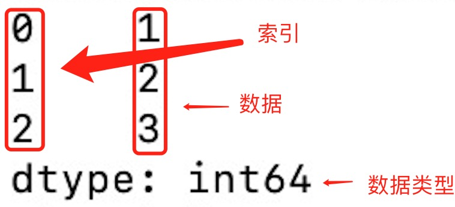

如果没有指定索引，索引值就从 0 开始，我们可以根据索引值读取数据：
```python
import pandas as pd

a = [1, 2, 3]

myvar = pd.Series(a)

print(myvar[1])
```
```python
import pandas as pd

a = ["Google", "Runoob", "Wiki"]

myvar = pd.Series(a, index = ["x", "y", "z"])

print(myvar)
```
我们也可以使用 key/value 对象，类似字典来创建 Series：
```python
import pandas as pd

sites = {1: "Google", 2: "Runoob", 3: "Wiki"}

myvar = pd.Series(sites)

print(myvar)
```
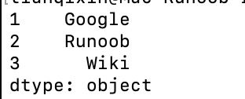

如果我们只需要字典中的一部分数据，只需要指定需要数据的索引即可，如下实例：
```python

import pandas as pd

sites = {1: "Google", 2: "Runoob", 3: "Wiki"}

myvar = pd.Series(sites, index = [1, 2])

print(myvar)
```
```python
import pandas as pd

sites = {1: "Google", 2: "Runoob", 3: "Wiki"}

myvar = pd.Series(sites, index = [1, 2], name="RUNOOB-Series-TEST" )

print(myvar)
```
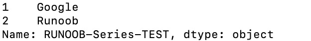

其他操作：
```text
# 获取值
value = series[2]  # 获取索引为2的值

# 获取多个值
subset = series[1:4]  # 获取索引为1到3的值

# 使用自定义索引
value = series_with_index['b']  # 获取索引为'b'的值

# 索引和值的对应关系
for index, value in series_with_index.items():
    print(f"Index: {index}, Value: {value}")
    
# 算术运算
result = series * 2  # 所有元素乘以2

# 过滤
filtered_series = series[series > 2]  # 选择大于2的元素

# 数学函数
import numpy as np
result = np.sqrt(series)  # 对每个元素取平方根

# 获取索引
index = series_with_index.index

# 获取值数组
values = series_with_index.values

# 获取描述统计信息
stats = series_with_index.describe()

# 获取最大值和最小值的索引
max_index = series_with_index.idxmax()
min_index = series_with_index.idxmin()

```
```text
注意事项：

Series 中的数据是有序的。
可以将 Series 视为带有索引的一维数组。
索引可以是唯一的，但不是必须的。
数据可以是标量、列表、NumPy 数组等。
```
# DataFrame
DataFrame 是一个表格型的数据结构，它含有一组有序的列，每列可以是不同的值类型（数值、字符串、布尔型值）。DataFrame 既有行索引也有列索引，它可以被看做由 Series 组成的字典（共同用一个索引）。

```text
DataFrame 特点：

列和行： DataFrame 由多个列组成，每一列都有一个名称，可以看作是一个 Series。同时，DataFrame 有一个行索引，用于标识每一行。

二维结构： DataFrame 是一个二维表格，具有行和列。可以将其视为多个 Series 对象组成的字典。

列的数据类型： 不同的列可以包含不同的数据类型，例如整数、浮点数、字符串等。
```
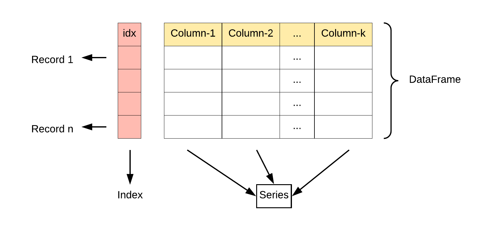
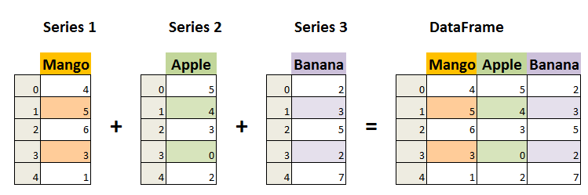

`pandas.DataFrame( data, index, columns, dtype, copy)
`
```text
参数说明：

data：一组数据(ndarray、series, map, lists, dict 等类型)。

index：索引值，或者可以称为行标签。

columns：列标签，默认为 RangeIndex (0, 1, 2, …, n) 。

dtype：数据类型。

copy：拷贝数据，默认为 False。
```
```python
import pandas as pd

data = [['Google', 10], ['Runoob', 12], ['Wiki', 13]]

# 创建DataFrame
df = pd.DataFrame(data, columns=['Site', 'Age'])

# 使用astype方法设置每列的数据类型
df['Site'] = df['Site'].astype(str)
df['Age'] = df['Age'].astype(float)

print(df)
```
也可以使用字典来创建：
```python
import pandas as pd

data = {'Site':['Google', 'Runoob', 'Wiki'], 'Age':[10, 12, 13]}

df = pd.DataFrame(data)

print (df)
```
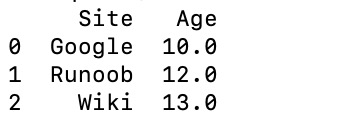


以下实例使用 ndarrays 创建，ndarray 的长度必须相同， 如果传递了 index，则索引的长度应等于数组的长度。如果没有传递索引，则默认情况下，索引将是range(n)，其中n是数组长度。
```python
import numpy as np
import pandas as pd

# 创建一个包含网站和年龄的二维ndarray
ndarray_data = np.array([
    ['Google', 10],
    ['Runoob', 12],
    ['Wiki', 13]
])

# 使用DataFrame构造函数创建数据帧
df = pd.DataFrame(ndarray_data, columns=['Site', 'Age'])

# 打印数据帧
print(df)
```


从以上输出结果可以知道， DataFrame 数据类型一个表格，包含 rows（行） 和 columns（列）：

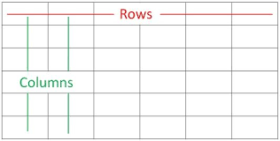

还可以使用字典（key/value），其中字典的 key 为列名:
```python
import pandas as pd

data = [{'a': 1, 'b': 2},{'a': 5, 'b': 10, 'c': 20}]

df = pd.DataFrame(data)

print (df)
```
没有对应的部分数据为 NaN。

Pandas 可以使用 loc 属性返回指定行的数据，如果没有设置索引，第一行索引为 0，第二行索引为 1，以此类推：
```python
import pandas as pd

data = {
 "calories": [420, 380, 390],
 "duration": [50, 40, 45]
}

# 数据载入到 DataFrame 对象
df = pd.DataFrame(data)

# 返回第一行
print(df.loc[0])
# 返回第二行
print(df.loc[1])
```

**注意**：返回结果其实就是一个 Pandas Series 数据。

也可以返回多行数据，使用 [[ ... ]] 格式，... 为各行的索引，以逗号隔开：

```python
import pandas as pd

data = {
 "calories": [420, 380, 390],
 "duration": [50, 40, 45]
}

# 数据载入到 DataFrame 对象
df = pd.DataFrame(data)

# 返回第一行和第二行
print(df.loc[[0, 1]])
```
Pandas 可以使用 loc 属性返回指定索引对应到某一行：

```python
import pandas as pd

data = {
    "calories": [420, 380, 390],
    "duration": [50, 40, 45]
}

df = pd.DataFrame(data, index = ["day1", "day2", "day3"])

# 指定索引
print(df.loc["day2"])
```
```text
更多 DataFrame 说明
基本操作：

# 获取列
name_column = df['Name']

# 获取行
first_row = df.loc[0]

# 选择多列
subset = df[['Name', 'Age']]

# 过滤行
filtered_rows = df[df['Age'] > 30]
属性和方法：

# 获取列名
columns = df.columns

# 获取形状（行数和列数）
shape = df.shape

# 获取索引
index = df.index

# 获取描述统计信息
stats = df.describe()
数据操作：

# 添加新列
df['Salary'] = [50000, 60000, 70000]

# 删除列
df.drop('City', axis=1, inplace=True)

# 排序
df.sort_values(by='Age', ascending=False, inplace=True)

# 重命名列
df.rename(columns={'Name': 'Full Name'}, inplace=True)
从外部数据源创建 DataFrame：

# 从CSV文件创建 DataFrame
df_csv = pd.read_csv('example.csv')

# 从Excel文件创建 DataFrame
df_excel = pd.read_excel('example.xlsx')

# 从字典列表创建 DataFrame
data_list = [{'Name': 'Alice', 'Age': 25}, {'Name': 'Bob', 'Age': 30}]
df_from_list = pd.DataFrame(data_list)
```
```text
注意事项：

DataFrame 是一种灵活的数据结构，可以容纳不同数据类型的列。
列名和行索引可以是字符串、整数等。
DataFrame 可以通过多种方式进行数据选择、过滤、修改和分析。
通过对 DataFrame 的操作，可以进行数据清洗、转换、分析和可视化等工作。
```
# CSV文件

```python
import pandas as pd

df = pd.read_csv('nba.csv')

print(df.to_string())
```
to_string() 用于返回 DataFrame 类型的数据，如果不使用该函数，则输出结果为数据的前面 5 行和末尾 5 行，中间部分以 ... 代替。

```python
import pandas as pd

df = pd.read_csv('nba.csv')

print(df)
```
我们也可以使用 to_csv() 方法将 DataFrame 存储为 csv 文件:
```python
import pandas as pd 

# 三个字段 name, site, age
nme = ["Google", "Runoob", "Taobao", "Wiki"]
st = ["www.google.com", "www.runoob.com", "www.taobao.com", "www.wikipedia.org"]
ag = [90, 40, 80, 98]

# 字典
dict = {'name': nme, 'site': st, 'age': ag} 

df = pd.DataFrame(dict)

# 保存 dataframe
df.to_csv('site.csv')
```
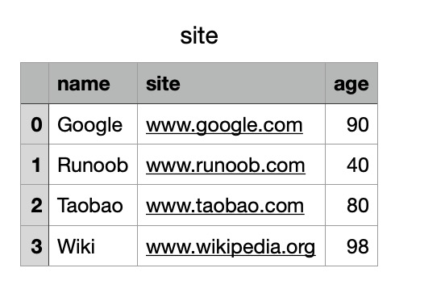

## 数据处理
### head()
head( n ) 方法用于读取前面的 n 行，如果不填参数 n ，默认返回 5 行。

```python
import pandas as pd

df = pd.read_csv('nba.csv')

print(df.head())
```
```python
import pandas as pd

df = pd.read_csv('nba.csv')

print(df.head(10))
```
### tail()
tail( n ) 方法用于读取尾部的 n 行，如果不填参数 n ，默认返回 5 行，空行各个字段的值返回 NaN。

```python
import pandas as pd

df = pd.read_csv('nba.csv')

print(df.tail())
```
```python
import pandas as pd

df = pd.read_csv('nba.csv')

print(df.tail(10))
```
### info()
info() 方法返回表格的一些基本信息：

```python
import pandas as pd

df = pd.read_csv('nba.csv')

print(df.info())
```
# JSON
Pandas 可以很方便的处理 JSON 数据，本文以 sites.json 为例，内容如下：
```json
[
   {
   "id": "A001",
   "name": "菜鸟教程",
   "url": "www.runoob.com",
   "likes": 61
   },
   {
   "id": "A002",
   "name": "Google",
   "url": "www.google.com",
   "likes": 124
   },
   {
   "id": "A003",
   "name": "淘宝",
   "url": "www.taobao.com",
   "likes": 45
   }
]
```

to_string() 用于返回 DataFrame 类型的数据，我们也可以直接处理 JSON 字符串。
```python
import pandas as pd

data =[
 {
 "id": "A001",
 "name": "菜鸟教程",
 "url": "www.runoob.com",
 "likes": 61
 },
 {
 "id": "A002",
 "name": "Google",
 "url": "www.google.com",
 "likes": 124
 },
 {
 "id": "A003",
 "name": "淘宝",
 "url": "www.taobao.com",
 "likes": 45
 }
]
df = pd.DataFrame(data)

print(df)
```

JSON 对象与 Python 字典具有相同的格式，所以我们可以直接将 Python 字典转化为 DataFrame 数据：

从 URL 中读取 JSON 数据：


```python
import pandas as pd
URL = 'https://static.jyshare.com/download/sites.json'
df = pd.read_json(URL)
print(df)

```
## 内嵌的 JSON 数据
假设有一组内嵌的 JSON 数据文件 nested_list.json ：
```nest_list.json
{
    "school_name": "ABC primary school",
    "class": "Year 1",
    "students": [
    {
        "id": "A001",
        "name": "Tom",
        "math": 60,
        "physics": 66,
        "chemistry": 61
    },
    {
        "id": "A002",
        "name": "James",
        "math": 89,
        "physics": 76,
        "chemistry": 51
    },
    {
        "id": "A003",
        "name": "Jenny",
        "math": 79,
        "physics": 90,
        "chemistry": 78
    }]
}
```
```python
import pandas as pd

df = pd.read_json('nested_list.json')

print(df)
```
运行结果（使用`df.to_string()`)

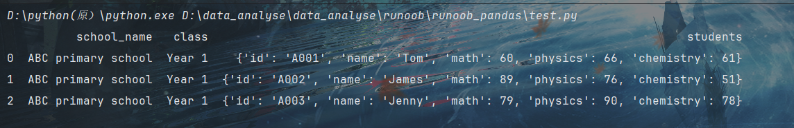

这时我们就需要使用到 json_normalize() 方法将内嵌的数据完整的解析出来：

```python
import pandas as pd
import json

# 使用 Python JSON 模块载入数据
with open('nested_list.json','r') as f:
    data = json.loads(f.read())

# 展平数据
df_nested_list = pd.json_normalize(data, record_path =['students'])
print(df_nested_list)
```
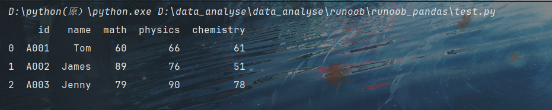

```test
data = json.loads(f.read()) 使用 Python JSON 模块载入数据。

json_normalize() 使用了参数 record_path 并设置为 ['students'] 用于展开内嵌的 JSON 数据 students。
```
显示结果还没有包含 school_name 和 class 元素，如果需要展示出来可以使用 meta 参数来显示这些元数据：

```python
import pandas as pd
import json

# 使用 Python JSON 模块载入数据
with open('nested_list.json','r') as f:
    data = json.loads(f.read())

# 展平数据
df_nested_list = pd.json_normalize(
    data,
    record_path =['students'],
    meta=['school_name', 'class']
)
print(df_nested_list)

```
### 读取内嵌数据中的一组数据
这里我们需要使用到 glom 模块来处理数据套嵌，glom 模块允许我们使用 . 来访问内嵌对象的属性。
```python
import pandas as pd
from glom import glom

df = pd.read_json('nested_deep.json')

data = df['students'].apply(lambda row: glom(row, 'grade.math'))
print(data)
```
# 数据清洗
## pandas清洗空值
如果我们要删除包含空字段的行，可以使用 dropna() 方法，语法格式如下：
`DataFrame.dropna(axis=0, how='any', thresh=None, subset=None, inplace=False)`
```text
参数说明：

axis：默认为 0，表示逢空值剔除整行，如果设置参数 axis＝1 表示逢空值去掉整列。
how：默认为 'any' 如果一行（或一列）里任何一个数据有出现 NA 就去掉整行，如果设置 how='all' 一行（或列）都是 NA 才去掉这整行。
thresh：设置需要多少非空值的数据才可以保留下来的。
subset：设置想要检查的列。如果是多个列，可以使用列名的 list 作为参数。
inplace：如果设置 True，将计算得到的值直接覆盖之前的值并返回 None，修改的是源数据。
我们可以通过 isnull() 判断各个单元格是否为空。
```
```python
import pandas as pd

df = pd.read_csv('property-data.csv')

print (df['NUM_BEDROOMS'])
print (df['NUM_BEDROOMS'].isnull())
```
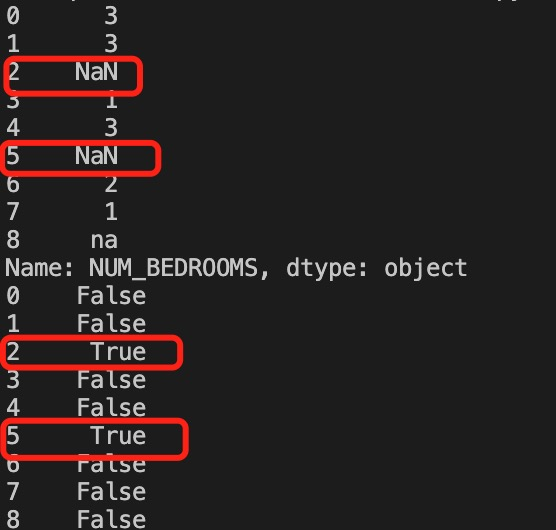

以上例子中我们看到 Pandas 把 n/a 和 NA 当作空数据，na 不是空数据，不符合我们要求，我们可以指定空数据类型：

```python
import pandas as pd

missing_values = ["n/a", "na", "--"]
df = pd.read_csv('property-data.csv', na_values = missing_values)

print (df['NUM_BEDROOMS'])
print (df['NUM_BEDROOMS'].isnull())
```
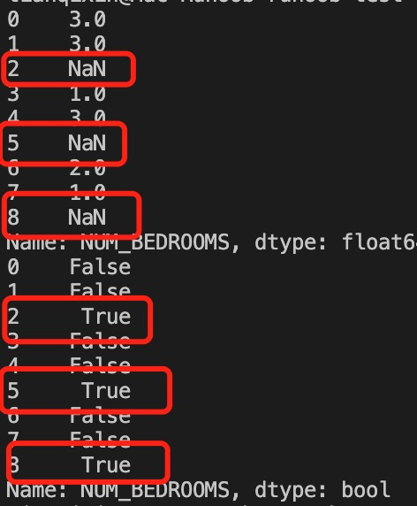

```python
import pandas as pd

df = pd.read_csv('property-data.csv')

new_df = df.dropna()

print(new_df.to_string())
```
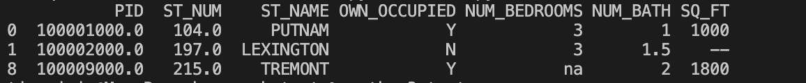

注意：默认情况下，dropna() 方法返回一个新的 DataFrame，不会修改源数据。

如果你要修改源数据 DataFrame, 可以使用 inplace = True 参数:

```python
import pandas as pd

df = pd.read_csv('property-data.csv')

df.dropna(inplace = True)

print(df.to_string())
```
我们也可以移除指定列有空值的行：

```python
import pandas as pd

df = pd.read_csv('property-data.csv')

df.dropna(subset=['ST_NUM'], inplace = True)

print(df.to_string())
```
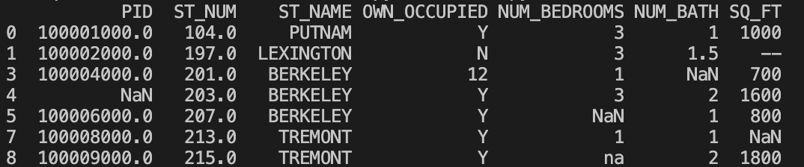

我们也可以 fillna() 方法来替换一些空字段：

```python
import pandas as pd

df = pd.read_csv('property-data.csv')

df.fillna(12345, inplace = True)

print(df.to_string())
```
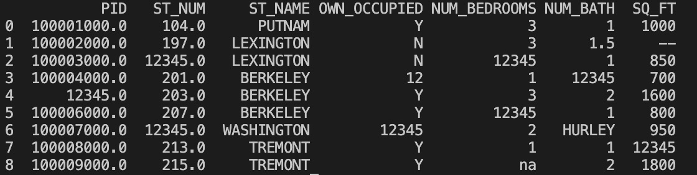

```python
import pandas as pd

df = pd.read_csv('property-data.csv')

df['PID'].fillna(12345, inplace = True)

print(df.to_string())
```
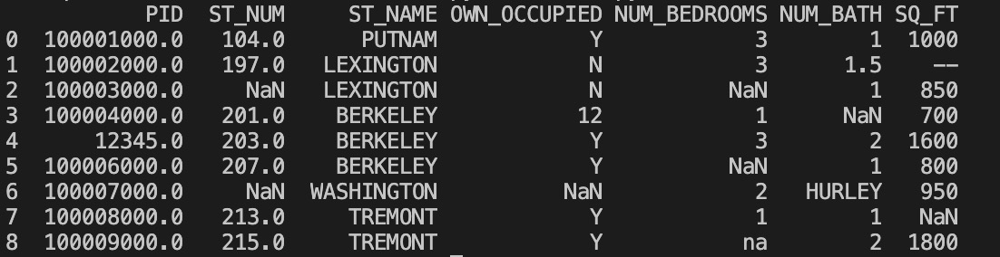

替换空单元格的常用方法是计算列的均值、中位数值或众数。

Pandas使用 mean()、median() 和 mode() 方法计算列的均值（所有值加起来的平均值）、中位数值（排序后排在中间的数）和众数（出现频率最高的数）。

```python
#使用 mean() 方法计算列的均值并替换空单元格：
import pandas as pd

df = pd.read_csv('property-data.csv')

x = df["ST_NUM"].mean()

df["ST_NUM"].fillna(x, inplace = True)

print(df.to_string())
```
```python
# 使用 median() 方法计算列的中位数并替换空单元格：
import pandas as pd

df = pd.read_csv('property-data.csv')

x = df["ST_NUM"].median()

df["ST_NUM"].fillna(x, inplace = True)

print(df.to_string())
```
```python
#使用 mode() 方法计算列的众数并替换空单元格：
import pandas as pd

df = pd.read_csv('property-data.csv')

x = df["ST_NUM"].mode()

df["ST_NUM"].fillna(x, inplace = True)

print(df.to_string())
```

## Pandas 清洗格式错误数据
我们可以通过包含空单元格的行，或者将列中的所有单元格转换为相同格式的数据。
```python
import pandas as pd

# 第三个日期格式错误
data = {
"Date": ['2020/12/01', '2020/12/02' , '20201226'],
"duration": [50, 40, 45]
}

df = pd.DataFrame(data, index = ["day1", "day2", "day3"])

df['Date'] = pd.to_datetime(df['Date'])

print(df.to_string())
```
## 清洗错误数据
```python
import pandas as pd

person = {
  "name": ['Google', 'Runoob' , 'Taobao'],
  "age": [50, 40, 12345]    # 12345 年龄数据是错误的
}

df = pd.DataFrame(person)

df.loc[2, 'age'] = 30 # 修改数据

print(df.to_string())
```
也可以设置条件语句：

 ```python
 # (将 age 大于 120 的设置为 120:)
import pandas as pd

person = {
  "name": ['Google', 'Runoob' , 'Taobao'],
  "age": [50, 200, 12345]    
}

df = pd.DataFrame(person)

for x in df.index:
  if df.loc[x, "age"] > 120:
    df.loc[x, "age"] = 120

print(df.to_string())
```
```python
#将 age 大于 120 的删除:
import pandas as pd

person = {
  "name": ['Google', 'Runoob' , 'Taobao'],
  "age": [50, 40, 12345]    # 12345 年龄数据是错误的
}

df = pd.DataFrame(person)

for x in df.index:
  if df.loc[x, "age"] > 120:
    df.drop(x, inplace = True)

print(df.to_string())
```
## 清洗重复数据
如果我们要清洗重复数据，可以使用 duplicated() 和 drop_duplicates() 方法。

如果对应的数据是重复的，duplicated() 会返回 True，否则返回 False。

```python
import pandas as pd

person = {
  "name": ['Google', 'Runoob', 'Runoob', 'Taobao'],
  "age": [50, 40, 40, 23]  
}
df = pd.DataFrame(person)

print(df.duplicated())
```
删除重复数据，可以直接使用drop_duplicates() 方法。

```python
import pandas as pd

persons = {
  "name": ['Google', 'Runoob', 'Runoob', 'Taobao'],
  "age": [50, 40, 40, 23]  
}

df = pd.DataFrame(persons)

df.drop_duplicates(inplace = True)
```


